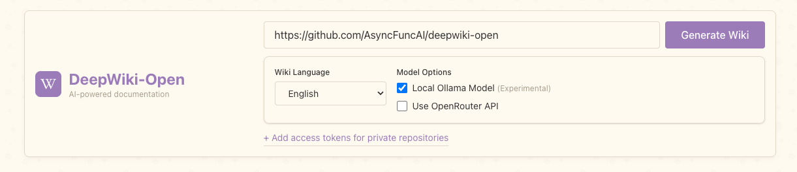

# Using DeepWiki with Ollama: Beginner's Guide

DeepWiki supports local AI models through Ollama, which is perfect if you want to:

- Run everything locally without relying on cloud APIs
- Avoid API costs from OpenAI or Google
- Have more privacy with your code analysis

## Step 1: Install Ollama

### For Windows
- Download Ollama from the [official website](https://ollama.com/download)
- Run the installer and follow the on-screen instructions
- After installation, Ollama will run in the background (check your system tray)

### For macOS
- Download Ollama from the [official website](https://ollama.com/download)
- Open the downloaded file and drag Ollama to your Applications folder
- Launch Ollama from your Applications folder

### For Linux
- Run the following command:
  ```bash
  curl -fsSL https://ollama.com/install.sh | sh
  ```

## Step 2: Download Required Models

Open a terminal (Command Prompt or PowerShell on Windows) and run:

```bash
ollama pull nomic-embed-text
ollama pull qwen3:1.7b
```

The first command downloads the embedding model that DeepWiki uses to understand your code. The second downloads a small but capable language model for generating documentation.

## Step 3: Set Up DeepWiki

Clone the DeepWiki repository:
```bash
git clone https://github.com/AsyncFuncAI/deepwiki-open.git
cd deepwiki-open
```

Create a `.env` file in the project root:
```
# No need for API keys when using Ollama locally
PORT=8001
# Optionally, provide OLLAMA_HOST if Ollama is not local
OLLAMA_HOST=your_ollama_host # (default: http://localhost:11434)
```

Configure the Local Embedder for Ollama:
```
cp api/config/embedder.ollama.json.bak api/config/embedder.json
# overwrite api/config/embedder.json? (y/n [n]) y
```

Start the backend:
```bash
pip install -r api/requirements.txt
python -m api.main
```

Start the frontend:
```bash
npm install
npm run dev
```

## Step 4: Use DeepWiki with Ollama

1. Open http://localhost:3000 in your browser
2. Enter a GitHub, GitLab, or Bitbucket repository URL
3. Check the use "Local Ollama Model" option
4. Click "Generate Wiki"



## Alternative using Dockerfile

1. Build the docker image `docker build -f Dockerfile-ollama-local -t deepwiki:ollama-local .`
2. Run the container:
   ```bash
   # For regular use
   docker run -p 3000:3000 -p 8001:8001 --name deepwiki \
     -v ~/.adalflow:/root/.adalflow \
     -e OLLAMA_HOST=your_ollama_host \
     deepwiki:ollama-local
   
   # For local repository analysis
   docker run -p 3000:3000 -p 8001:8001 --name deepwiki \
     -v ~/.adalflow:/root/.adalflow \
     -e OLLAMA_HOST=your_ollama_host \
     -v /path/to/your/repo:/app/local-repos/repo-name \
     deepwiki:ollama-local
   ```

3. When using local repositories in the interface: use `/app/local-repos/repo-name` as the local repository path.

4. Open http://localhost:3000 in your browser

Note: For Apple Silicon Macs, the Dockerfile automatically uses ARM64 binaries for better performance.

## How It Works

When you select "Use Local Ollama", DeepWiki will:

1. Use the `nomic-embed-text` model for creating embeddings of your code
2. Use the `qwen3:1.7b` model for generating documentation
3. Process everything locally on your machine

## Troubleshooting

### "Cannot connect to Ollama server"
- Make sure Ollama is running in the background. You can check by running `ollama list` in your terminal.
- Verify that Ollama is running on the default port (11434)
- Try restarting Ollama

### Slow generation
- Local models are typically slower than cloud APIs. Consider using a smaller repository or a more powerful computer.
- The `qwen3:1.7b` model is optimized for speed and quality balance. Larger models will be slower but may produce better results.

### Out of memory errors
- If you encounter memory issues, try using a smaller model like `phi3:mini` instead of larger models.
- Close other memory-intensive applications while running Ollama

## Advanced: Using Different Models

If you want to try different models, you can modify the `api/config/generator.json` file:

```python
"generator_ollama": {
    "model_client": OllamaClient,
    "model_kwargs": {
        "model": "qwen3:1.7b",  # Change this to another model
        "options": {
            "temperature": 0.7,
            "top_p": 0.8,
        }
    },
},
```

You can replace `"model": "qwen3:1.7b"` with any model you've pulled with Ollama. For a list of available models, visit [Ollama's model library](https://ollama.com/library) or run `ollama list` in your terminal.

Similarly, you can change the embedding model:

```python
"embedder_ollama": {
    "model_client": OllamaClient,
    "model_kwargs": {
        "model": "nomic-embed-text"  # Change this to another embedding model
    },
},
```

## Performance Considerations

### Hardware Requirements

For optimal performance with Ollama:
- **CPU**: 4+ cores recommended
- **RAM**: 8GB minimum, 16GB+ recommended
- **Storage**: 10GB+ free space for models
- **GPU**: Optional but highly recommended for faster processing

### Model Selection Guide

| Model | Size | Speed | Quality | Use Case |
|-------|------|-------|---------|----------|
| phi3:mini | 1.3GB | Fast | Good | Small projects, quick testing |
| qwen3:1.7b | 3.8GB | Medium | Better | Default, good balance |
| llama3:8b | 8GB | Slow | Best | Complex projects, detailed analysis |

## Limitations

When using Ollama with DeepWiki:

1. **No Internet Access**: The models run completely offline and cannot access external information
2. **Limited Context Window**: Local models typically have smaller context windows than cloud APIs
3. **Less Powerful**: Local models may not match the quality of the latest cloud models

## Conclusion

Using DeepWiki with Ollama gives you a completely local, private solution for code documentation. While it may not match the speed or quality of cloud-based solutions, it provides a free and privacy-focused alternative that works well for most projects.

Enjoy using DeepWiki with your local Ollama models!
