# DeepWiki-Open


**DeepWiki** crea automáticamente wikis hermosas e interactivas para cualquier repositorio de GitHub, GitLab o BitBucket. ¡Solo ingresa el nombre de un repositorio y DeepWiki:

1. Analizará la estructura del código
2. Generará documentación completa
3. Creará diagramas visuales para explicar cómo funciona todo
4. Organizará todo en una wiki fácil de navegar

[](https://buymeacoffee.com/sheing)

[](https://x.com/sashimikun_void)
[](https://discord.com/invite/VQMBGR8u5v)

## ✨ Características

- **Documentación Instantánea**: Convierte cualquier repositorio de GitHub, GitLab o BitBucket en una wiki en segundos
- **Soporte para Repositorios Privados**: Accede de forma segura a repositorios privados con tokens de acceso personal
- **Análisis Inteligente**: Comprensión de la estructura y relaciones del código impulsada por IA
- **Diagramas Hermosos**: Diagramas Mermaid automáticos para visualizar la arquitectura y el flujo de datos
- **Navegación Sencilla**: Interfaz simple e intuitiva para explorar la wiki
- **Función de Preguntas**: Chatea con tu repositorio usando IA potenciada por RAG para obtener respuestas precisas
- **Investigación Profunda**: Proceso de investigación de múltiples turnos que examina a fondo temas complejos
- **Múltiples Proveedores de Modelos**: Soporte para Google Gemini, OpenAI, OpenRouter y modelos locales de Ollama

## 🚀 Inicio Rápido (¡Súper Fácil!)

### Opción 1: Usando Docker

```bash
# Clonar el repositorio
git clone https://github.com/AsyncFuncAI/deepwiki-open.git
cd deepwiki-open

# Crear un archivo .env con tus claves API
echo "GOOGLE_API_KEY=your_google_api_key" > .env
echo "OPENAI_API_KEY=your_openai_api_key" >> .env
# Opcional: Añadir clave API de OpenRouter si quieres usar modelos de OpenRouter
echo "OPENROUTER_API_KEY=your_openrouter_api_key" >> .env

# Ejecutar con Docker Compose
docker-compose up
```

(Los comandos de Docker anteriores, así como la configuración de `docker-compose.yml`, montan el directorio `~/.adalflow` de tu host en `/root/.adalflow` dentro del contenedor. Esta ruta se utiliza para almacenar:
- Repositorios clonados (`~/.adalflow/repos/`)
- Sus embeddings e índices (`~/.adalflow/databases/`)
- Contenido de wiki generado y cacheado (`~/.adalflow/wikicache/`)

Esto asegura que tus datos persistan incluso si el contenedor se detiene o se elimina.)

> 💡 **Dónde obtener estas claves:**
> - Obtén una clave API de Google en [Google AI Studio](https://makersuite.google.com/app/apikey)
> - Obtén una clave API de OpenAI en [OpenAI Platform](https://platform.openai.com/api-keys)

### Opción 2: Configuración Manual (Recomendada)

#### Paso 1: Configurar tus Claves API

Crea un archivo `.env` en la raíz del proyecto con estas claves:

```
GOOGLE_API_KEY=your_google_api_key
OPENAI_API_KEY=your_openai_api_key
# Opcional: Añade esto si quieres usar modelos de OpenRouter
OPENROUTER_API_KEY=your_openrouter_api_key
```

#### Paso 2: Iniciar el Backend

```bash
# Instalar dependencias de Python
pip install -r api/requirements.txt

# Iniciar el servidor API
python -m api.main
```

#### Paso 3: Iniciar el Frontend

```bash
# Instalar dependencias de JavaScript
npm install
# o
yarn install

# Iniciar la aplicación web
npm run dev
# o
yarn dev
```

#### Paso 4: ¡Usar DeepWiki!

1. Abre [http://localhost:3000](http://localhost:3000) en tu navegador
2. Ingresa un repositorio de GitHub, GitLab o Bitbucket (como `https://github.com/openai/codex`, `https://github.com/microsoft/autogen`, `https://gitlab.com/gitlab-org/gitlab`, o `https://bitbucket.org/redradish/atlassian_app_versions`)
3. Para repositorios privados, haz clic en "+ Agregar tokens de acceso" e ingresa tu token de acceso personal de GitHub o GitLab
4. ¡Haz clic en "Generar Wiki" y observa la magia suceder!

## 🔍 Cómo Funciona

DeepWiki usa IA para:

1. Clonar y analizar el repositorio de GitHub, GitLab o Bitbucket (incluyendo repos privados con autenticación por token)
2. Crear embeddings del código para recuperación inteligente
3. Generar documentación con IA consciente del contexto (usando modelos de Google Gemini, OpenAI, OpenRouter o Ollama local)
4. Crear diagramas visuales para explicar las relaciones del código
5. Organizar todo en una wiki estructurada
6. Habilitar preguntas y respuestas inteligentes con el repositorio a través de la función de Preguntas
7. Proporcionar capacidades de investigación en profundidad con Investigación Profunda

```mermaid
graph TD
    A[Usuario ingresa repo GitHub/GitLab/Bitbucket] --> AA{¿Repo privado?}
    AA -->|Sí| AB[Agregar token de acceso]
    AA -->|No| B[Clonar Repositorio]
    AB --> B
    B --> C[Analizar Estructura del Código]
    C --> D[Crear Embeddings del Código]

    D --> M{Seleccionar Proveedor de Modelo}
    M -->|Google Gemini| E1[Generar con Gemini]
    M -->|OpenAI| E2[Generar con OpenAI]
    M -->|OpenRouter| E3[Generar con OpenRouter]
    M -->|Ollama Local| E4[Generar con Ollama]

    E1 --> E[Generar Documentación]
    E2 --> E
    E3 --> E
    E4 --> E

    D --> F[Crear Diagramas Visuales]
    E --> G[Organizar como Wiki]
    F --> G
    G --> H[DeepWiki Interactiva]

    classDef process stroke-width:2px;
    classDef data stroke-width:2px;
    classDef result stroke-width:2px;
    classDef decision stroke-width:2px;

    class A,D data;
    class AA,M decision;
    class B,C,E,F,G,AB,E1,E2,E3,E4 process;
    class H result;
```



## 🛠️ Estructura del Proyecto

```
deepwiki/
├── api/                  # Servidor API backend
│   ├── main.py           # Punto de entrada de la API
│   ├── api.py            # Implementación FastAPI
│   ├── rag.py            # Generación Aumentada por Recuperación
│   ├── data_pipeline.py  # Utilidades de procesamiento de datos
│   └── requirements.txt  # Dependencias Python
│
├── src/                  # App frontend Next.js
│   ├── app/              # Directorio app de Next.js
│   │   └── page.tsx      # Página principal de la aplicación
│   └── components/       # Componentes React
│       └── Mermaid.tsx   # Renderizador de diagramas Mermaid
│
├── public/               # Activos estáticos
├── package.json          # Dependencias JavaScript
└── .env                  # Variables de entorno (crear este archivo)
```

## 🤖 Funciones de Preguntas e Investigación Profunda

### Función de Preguntas

La función de Preguntas te permite chatear con tu repositorio usando Generación Aumentada por Recuperación (RAG):

- **Respuestas Conscientes del Contexto**: Obtén respuestas precisas basadas en el código real de tu repositorio
- **Potenciada por RAG**: El sistema recupera fragmentos de código relevantes para proporcionar respuestas fundamentadas
- **Transmisión en Tiempo Real**: Ve las respuestas mientras se generan para una experiencia más interactiva
- **Historial de Conversación**: El sistema mantiene el contexto entre preguntas para interacciones más coherentes

### Función de Investigación Profunda

Investigación Profunda lleva el análisis de repositorios al siguiente nivel con un proceso de investigación de múltiples turnos:

- **Investigación en Profundidad**: Explora a fondo temas complejos a través de múltiples iteraciones de investigación
- **Proceso Estructurado**: Sigue un plan de investigación claro con actualizaciones y una conclusión completa
- **Continuación Automática**: La IA continúa automáticamente la investigación hasta llegar a una conclusión (hasta 5 iteraciones)
- **Etapas de Investigación**:
  1. **Plan de Investigación**: Describe el enfoque y los hallazgos iniciales
  2. **Actualizaciones de Investigación**: Desarrolla las iteraciones anteriores con nuevas perspectivas
  3. **Conclusión Final**: Proporciona una respuesta completa basada en todas las iteraciones

Para usar Investigación Profunda, simplemente activa el interruptor "Investigación Profunda" en la interfaz de Preguntas antes de enviar tu pregunta.

## 📱 Capturas de Pantalla


*La interfaz principal de DeepWiki*


*Acceso a repositorios privados con tokens de acceso personal*


*Investigación Profunda realiza investigaciones de múltiples turnos para temas complejos*

### Video de Demostración

[](https://youtu.be/zGANs8US8B4)

*¡Mira DeepWiki en acción!*

## ❓ Solución de Problemas

### Problemas con Claves API
- **"Faltan variables de entorno"**: Asegúrate de que tu archivo `.env` esté en la raíz del proyecto y contenga las claves API requeridas
- **"Clave API no válida"**: Verifica que hayas copiado la clave completa correctamente sin espacios adicionales
- **"Error de API OpenRouter"**: Verifica que tu clave API de OpenRouter sea válida y tenga créditos suficientes

### Problemas de Conexión
- **"No se puede conectar al servidor API"**: Asegúrate de que el servidor API esté ejecutándose en el puerto 8001
- **"Error CORS"**: La API está configurada para permitir todos los orígenes, pero si tienes problemas, intenta ejecutar tanto el frontend como el backend en la misma máquina

### Problemas de Generación
- **"Error al generar wiki"**: Para repositorios muy grandes, prueba primero con uno más pequeño
- **"Formato de repositorio no válido"**: Asegúrate de usar un formato de URL válido para GitHub, GitLab o Bitbucket
- **"No se pudo obtener la estructura del repositorio"**: Para repositorios privados, asegúrate de haber ingresado un token de acceso personal válido con los permisos apropiados
- **"Error de renderizado de diagrama"**: La aplicación intentará automáticamente arreglar los diagramas rotos

### Soluciones Comunes
1. **Reiniciar ambos servidores**: A veces un simple reinicio soluciona la mayoría de los problemas
2. **Revisar los registros de la consola**: Abre las herramientas de desarrollo del navegador para ver cualquier error de JavaScript
3. **Revisar los registros de la API**: Mira la terminal donde se ejecuta la API para ver errores de Python

## 🤝 Contribuir

¡Las contribuciones son bienvenidas! Siéntete libre de:
- Abrir issues para bugs o solicitudes de funciones
- Enviar pull requests para mejorar el código
- Compartir tus comentarios e ideas

## 📄 Licencia

Este proyecto está licenciado bajo la Licencia MIT - consulta el archivo [LICENSE](LICENSE) para más detalles.

## ⭐ Historial de Estrellas

[](https://star-history.com/#AsyncFuncAI/deepwiki-open&Date)
