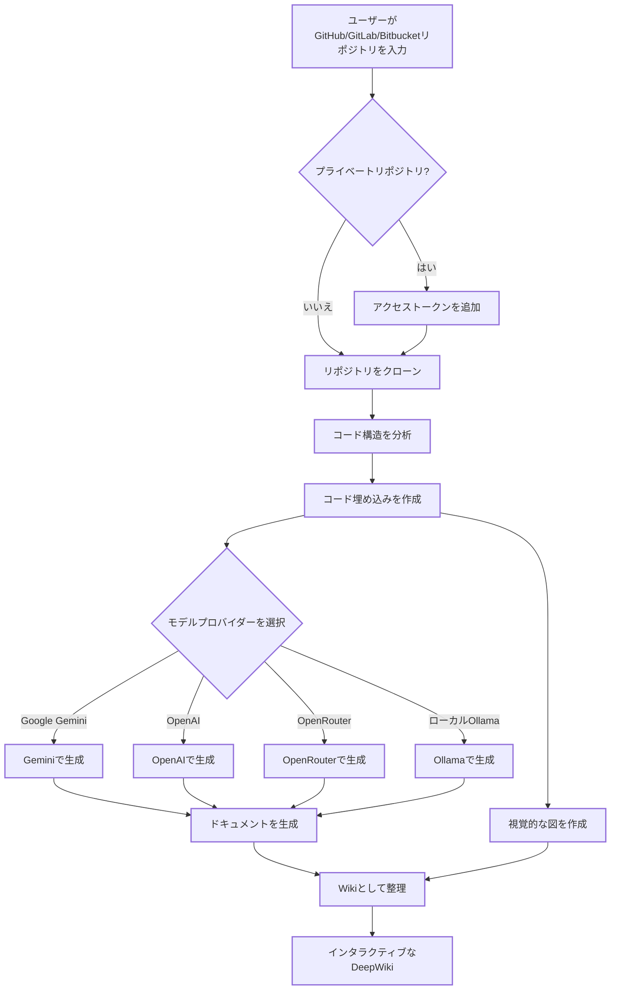

# DeepWiki-Open


**DeepWiki**は、GitHub、GitLab、またはBitbucketリポジトリのための美しくインタラクティブなWikiを自動的に作成します！リポジトリ名を入力するだけで、DeepWikiは以下を行います：

1. コード構造を分析
2. 包括的なドキュメントを生成
3. すべての仕組みを説明する視覚的な図を作成
4. すべてを簡単に閲覧できるWikiに整理

[](https://buymeacoffee.com/sheing)

[](https://x.com/sashimikun_void)
[](https://discord.com/invite/VQMBGR8u5v)

## ✨ 特徴

- **即時ドキュメント生成**: あらゆるGitHub、GitLab、またはBitbucketリポジトリを数秒でWikiに変換
- **プライベートリポジトリ対応**: 個人アクセストークンを使用してプライベートリポジトリに安全にアクセス
- **スマート分析**: AIを活用したコード構造と関係の理解
- **美しい図表**: アーキテクチャとデータフローを視覚化する自動Mermaid図
- **簡単なナビゲーション**: Wikiを探索するためのシンプルで直感的なインターフェース
- **質問機能**: RAG搭載AIを使用してリポジトリとチャットし、正確な回答を得る
- **詳細調査**: 複雑なトピックを徹底的に調査する多段階研究プロセス
- **複数のモデルプロバイダー**: Google Gemini、OpenAI、OpenRouter、およびローカルOllamaモデルのサポート

## 🚀 クイックスタート（超簡単！）

### オプション1: Dockerを使用

```bash
# リポジトリをクローン
git clone https://github.com/AsyncFuncAI/deepwiki-open.git
cd deepwiki-open

# APIキーを含む.envファイルを作成
echo "GOOGLE_API_KEY=your_google_api_key" > .env
echo "OPENAI_API_KEY=your_openai_api_key" >> .env
# オプション: OpenRouterモデルを使用する場合はOpenRouter APIキーを追加
echo "OPENROUTER_API_KEY=your_openrouter_api_key" >> .env

# Docker Composeで実行
docker-compose up
```

> 💡 **これらのキーの入手先:**
> - Google APIキーは[Google AI Studio](https://makersuite.google.com/app/apikey)から取得
> - OpenAI APIキーは[OpenAI Platform](https://platform.openai.com/api-keys)から取得

### オプション2: 手動セットアップ（推奨）

#### ステップ1: APIキーの設定

プロジェクトのルートに`.env`ファイルを作成し、以下のキーを追加します：

```
GOOGLE_API_KEY=your_google_api_key
OPENAI_API_KEY=your_openai_api_key
# オプション: OpenRouterモデルを使用する場合は追加
OPENROUTER_API_KEY=your_openrouter_api_key
```

#### ステップ2: バックエンドの起動

```bash
# Pythonの依存関係をインストール
pip install -r api/requirements.txt

# APIサーバーを起動
python -m api.main
```

#### ステップ3: フロントエンドの起動

```bash
# JavaScript依存関係をインストール
npm install
# または
yarn install

# Webアプリを起動
npm run dev
# または
yarn dev
```

#### ステップ4: DeepWikiを使用！

1. ブラウザで[http://localhost:3000](http://localhost:3000)を開く
2. GitHub、GitLab、またはBitbucketリポジトリを入力（例：`https://github.com/openai/codex`、`https://github.com/microsoft/autogen`、`https://gitlab.com/gitlab-org/gitlab`、または`https://bitbucket.org/redradish/atlassian_app_versions`）
3. プライベートリポジトリの場合は、「+ アクセストークンを追加」をクリックしてGitHubまたはGitLabの個人アクセストークンを入力
4. 「Wikiを生成」をクリックして、魔法が起こるのを見守りましょう！

## 🔍 仕組み

DeepWikiはAIを使用して：

1. GitHub、GitLab、またはBitbucketリポジトリをクローンして分析（トークン認証によるプライベートリポジトリを含む）
2. スマート検索のためのコードの埋め込みを作成
3. コンテキスト対応AIでドキュメントを生成（Google Gemini、OpenAI、OpenRouter、またはローカルOllamaモデルを使用）
4. コードの関係を説明する視覚的な図を作成
5. すべてを構造化されたWikiに整理
6. 質問機能を通じてリポジトリとのインテリジェントなQ&Aを可能に
7. 詳細調査機能で深い研究能力を提供



## 🛠️ プロジェクト構造

```
deepwiki/
├── api/                  # バックエンドAPIサーバー
│   ├── main.py           # APIエントリーポイント
│   ├── api.py            # FastAPI実装
│   ├── rag.py            # 検索拡張生成
│   ├── data_pipeline.py  # データ処理ユーティリティ
│   └── requirements.txt  # Python依存関係
│
├── src/                  # フロントエンドNext.jsアプリ
│   ├── app/              # Next.jsアプリディレクトリ
│   │   └── page.tsx      # メインアプリケーションページ
│   └── components/       # Reactコンポーネント
│       └── Mermaid.tsx   # Mermaid図レンダラー
│
├── public/               # 静的アセット
├── package.json          # JavaScript依存関係
└── .env                  # 環境変数（作成する必要あり）
```

## 🤖 質問と詳細調査機能

### 質問機能

質問機能を使用すると、検索拡張生成（RAG）を使用してリポジトリとチャットできます：

- **コンテキスト対応の回答**: リポジトリの実際のコードに基づいた正確な回答を取得
- **RAG搭載**: システムは関連するコードスニペットを取得して根拠のある回答を提供
- **リアルタイムストリーミング**: よりインタラクティブな体験のために、生成されるレスポンスをリアルタイムで確認
- **会話履歴**: システムは質問間のコンテキストを維持し、より一貫性のあるインタラクションを実現

### 詳細調査機能

詳細調査は、複数ターンの研究プロセスでリポジトリ分析を次のレベルに引き上げます：

- **詳細な調査**: 複数の研究反復を通じて複雑なトピックを徹底的に探索
- **構造化されたプロセス**: 明確な研究計画、更新、包括的な結論を含む
- **自動継続**: AIは結論に達するまで自動的に研究を継続（最大5回の反復）
- **研究段階**:
  1. **研究計画**: アプローチと初期調査結果の概要
  2. **研究更新**: 新しい洞察を加えて前の反復を発展
  3. **最終結論**: すべての反復に基づく包括的な回答を提供

詳細調査を使用するには、質問を送信する前に質問インターフェースの「詳細調査」スイッチをオンにするだけです。

## 📱 スクリーンショット


*DeepWikiのメインインターフェース*


*個人アクセストークンを使用したプライベートリポジトリへのアクセス*


*詳細調査は複雑なトピックに対して多段階の調査を実施*

### デモビデオ

[](https://youtu.be/zGANs8US8B4)

*DeepWikiの動作を見る！*

## ❓ トラブルシューティング

### APIキーの問題
- **「環境変数が見つかりません」**: `.env`ファイルがプロジェクトのルートにあり、必要なAPIキーが含まれていることを確認
- **「APIキーが無効です」**: キー全体が余分なスペースなしで正しくコピーされていることを確認
- **「OpenRouter APIエラー」**: OpenRouter APIキーが有効で、十分なクレジットがあることを確認

### 接続の問題
- **「APIサーバーに接続できません」**: APIサーバーがポート8001で実行されていることを確認
- **「CORSエラー」**: APIはすべてのオリジンを許可するように設定されていますが、問題がある場合は、フロントエンドとバックエンドを同じマシンで実行してみてください

### 生成の問題
- **「Wikiの生成中にエラーが発生しました」**: 非常に大きなリポジトリの場合は、まず小さいものから試してみてください
- **「無効なリポジトリ形式」**: 有効なGitHub、GitLab、またはBitbucket URLの形式を使用していることを確認
- **「リポジトリ構造を取得できませんでした」**: プライベートリポジトリの場合、適切な権限を持つ有効な個人アクセストークンを入力したことを確認
- **「図のレンダリングエラー」**: アプリは自動的に壊れた図を修正しようとします

### 一般的な解決策
1. **両方のサーバーを再起動**: 単純な再起動でほとんどの問題が解決することがあります
2. **コンソールログを確認**: ブラウザの開発者ツールを開いてJavaScriptエラーを確認
3. **APIログを確認**: APIが実行されているターミナルでPythonエラーを確認

## 🤝 貢献

貢献は歓迎します！以下のことを自由に行ってください：
- バグや機能リクエストの問題を開く
- コードを改善するためのプルリクエストを提出
- フィードバックやアイデアを共有

## 📄 ライセンス

このプロジェクトはMITライセンスの下でライセンスされています - 詳細は[LICENSE](LICENSE)ファイルを参照してください。

## ⭐ スター履歴

[](https://star-history.com/#AsyncFuncAI/deepwiki-open&Date)
