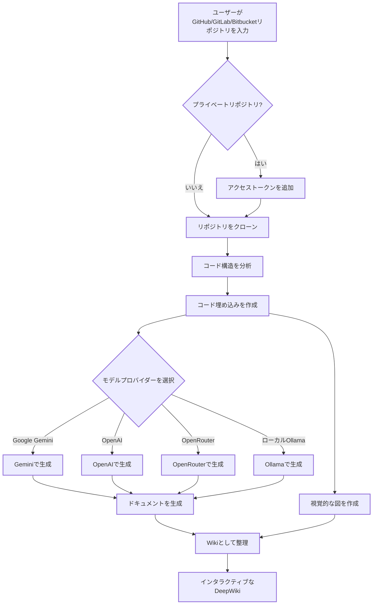

# DeepWiki-Open


**DeepWiki**は、GitHub、GitLab、または Bitbucket リポジトリのための美しくインタラクティブな Wiki を自動的に作成します！リポジトリ名を入力するだけで、DeepWiki は以下を行います：

1. コード構造を分析
2. 包括的なドキュメントを生成
3. すべての仕組みを説明する視覚的な図を作成
4. すべてを簡単に閲覧できる Wiki に整理

[](https://buymeacoffee.com/sheing)

[](https://x.com/sashimikun_void)
[](https://discord.com/invite/VQMBGR8u5v)

[English](./README.md) | [简体中文](./README.zh.md) | [日本語](./README.ja.md) | [Español](./README.es.md) | [한국어](./README.kr.md) | [Tiếng Việt](./README.vi.md) | [Português Brasileiro](./README.pt-br.md)

## ✨ 特徴

- **即時ドキュメント生成**: あらゆる GitHub、GitLab、または Bitbucket リポジトリを数秒で Wiki に変換
- **プライベートリポジトリ対応**: 個人アクセストークンを使用してプライベートリポジトリに安全にアクセス
- **スマート分析**: AI を活用したコード構造と関係の理解
- **美しい図表**: アーキテクチャとデータフローを視覚化する自動 Mermaid 図
- **簡単なナビゲーション**: Wiki を探索するためのシンプルで直感的なインターフェース
- **質問機能**: RAG 搭載 AI を使用してリポジトリとチャットし、正確な回答を得る
- **詳細調査**: 複雑なトピックを徹底的に調査する多段階研究プロセス
- **複数のモデルプロバイダー**: Google Gemini、OpenAI、OpenRouter、およびローカル Ollama モデルのサポート

## 🚀 クイックスタート（超簡単！）

### オプション 1: Docker を使用

```bash
# リポジトリをクローン
git clone https://github.com/AsyncFuncAI/deepwiki-open.git
cd deepwiki-open

# APIキーを含む.envファイルを作成
echo "GOOGLE_API_KEY=your_google_api_key" > .env
echo "OPENAI_API_KEY=your_openai_api_key" >> .env
# オプション: OpenRouterモデルを使用する場合はOpenRouter APIキーを追加
echo "OPENROUTER_API_KEY=your_openrouter_api_key" >> .env

# Docker Composeで実行
docker-compose up
```

(上記の Docker コマンドおよび`docker-compose.yml`の設定では、ホスト上の`~/.adalflow`ディレクトリをコンテナ内の`/root/.adalflow`にマウントします。このパスは以下のものを保存するために使用されます：

- クローンされたリポジトリ (`~/.adalflow/repos/`)
- それらのエンベディングとインデックス (`~/.adalflow/databases/`)
- 生成された Wiki のキャッシュ (`~/.adalflow/wikicache/`)

これにより、コンテナが停止または削除されてもデータが永続化されます。)

> 💡 **これらのキーの入手先:**
>
> - Google API キーは[Google AI Studio](https://makersuite.google.com/app/apikey)から取得
> - OpenAI API キーは[OpenAI Platform](https://platform.openai.com/api-keys)から取得

### オプション 2: 手動セットアップ（推奨）

#### ステップ 1: API キーの設定

プロジェクトのルートに`.env`ファイルを作成し、以下のキーを追加します：

```
GOOGLE_API_KEY=your_google_api_key
OPENAI_API_KEY=your_openai_api_key
# オプション: OpenRouterモデルを使用する場合は追加
OPENROUTER_API_KEY=your_openrouter_api_key
```

#### ステップ 2: バックエンドの起動

```bash
# Pythonの依存関係をインストール
pip install -r api/requirements.txt

# APIサーバーを起動
python -m api.main
```

#### ステップ 3: フロントエンドの起動

```bash
# JavaScript依存関係をインストール
npm install
# または
yarn install

# Webアプリを起動
npm run dev
# または
yarn dev
```

#### ステップ 4: DeepWiki を使用！

1. ブラウザで[http://localhost:3000](http://localhost:3000)を開く
2. GitHub、GitLab、または Bitbucket リポジトリを入力（例：`https://github.com/openai/codex`、`https://github.com/microsoft/autogen`、`https://gitlab.com/gitlab-org/gitlab`、または`https://bitbucket.org/redradish/atlassian_app_versions`）
3. プライベートリポジトリの場合は、「+ アクセストークンを追加」をクリックして GitHub または GitLab の個人アクセストークンを入力
4. 「Wiki を生成」をクリックして、魔法が起こるのを見守りましょう！

## 🔍 仕組み

DeepWiki は AI を使用して：

1. GitHub、GitLab、または Bitbucket リポジトリをクローンして分析（トークン認証によるプライベートリポジトリを含む）
2. スマート検索のためのコードの埋め込みを作成
3. コンテキスト対応 AI でドキュメントを生成（Google Gemini、OpenAI、OpenRouter、またはローカル Ollama モデルを使用）
4. コードの関係を説明する視覚的な図を作成
5. すべてを構造化された Wiki に整理
6. 質問機能を通じてリポジトリとのインテリジェントな Q&A を可能に
7. 詳細調査機能で深い研究能力を提供



## 🛠️ プロジェクト構造

```
deepwiki/
├── api/                  # バックエンドAPIサーバー
│   ├── main.py           # APIエントリーポイント
│   ├── api.py            # FastAPI実装
│   ├── rag.py            # 検索拡張生成
│   ├── data_pipeline.py  # データ処理ユーティリティ
│   └── requirements.txt  # Python依存関係
│
├── src/                  # フロントエンドNext.jsアプリ
│   ├── app/              # Next.jsアプリディレクトリ
│   │   └── page.tsx      # メインアプリケーションページ
│   └── components/       # Reactコンポーネント
│       └── Mermaid.tsx   # Mermaid図レンダラー
│
├── public/               # 静的アセット
├── package.json          # JavaScript依存関係
└── .env                  # 環境変数（作成する必要あり）
```

## 🛠️ 高度な設定

### 環境変数

| 変数                          | 説明                                                            | 必須 | 注意                                                                                                          |
| ----------------------------- | --------------------------------------------------------------- | ---- | ------------------------------------------------------------------------------------------------------------- |
| `GOOGLE_API_KEY`              | AI 生成のための Google Gemini API キー                          | ◯    |                                                                                                               |
| `OPENAI_API_KEY`              | 埋め込みのための OpenAI API キー                                | ◯    |                                                                                                               |
| `OPENROUTER_API_KEY`          | 代替モデルのための OpenRouter API キー                          | ✗    | OpenRouter モデルを使用する場合にのみ必須です                                                                 |
| `PORT`                        | API サーバーのポート（デフォルト：8001）                        | ✗    | API とフロントエンドを同じマシンでホストする場合、`NEXT_PUBLIC_SERVER_BASE_URL`のポートを適宜変更してください |
| `NEXT_PUBLIC_SERVER_BASE_URL` | API サーバーのベース URL（デフォルト：`http://localhost:8001`） | ✗    |                                                                                                               |

### 設定ファイル

DeepWikiはシステムの様々な側面を管理するためにJSON設定ファイルを使用しています：

1. **`generator.json`**: テキスト生成モデルの設定
   - 利用可能なモデルプロバイダー（Google、OpenAI、OpenRouter、Ollama）を定義
   - 各プロバイダーのデフォルトおよび利用可能なモデルを指定
   - temperatureやtop_pなどのモデル固有のパラメータを含む

2. **`embedder.json`**: 埋め込みモデルとテキスト処理の設定
   - ベクトルストレージ用の埋め込みモデルを定義
   - RAG用の検索設定を含む
   - ドキュメントチャンク分割のためのテキスト分割設定を指定

3. **`repo.json`**: リポジトリ処理の設定
   - 特定のファイルやディレクトリを除外するファイルフィルターを含む
   - リポジトリサイズ制限と処理ルールを定義

デフォルトでは、これらのファイルは`api/config/`ディレクトリにあります。`DEEPWIKI_CONFIG_DIR`環境変数を使用して、その場所をカスタマイズできます。

### Docker セットアップ

Docker を使用して DeepWiki を実行できます：

```bash
# GitHub Container Registryからイメージをプル
docker pull ghcr.io/asyncfuncai/deepwiki-open:latest

# 環境変数を設定してコンテナを実行
docker run -p 8001:8001 -p 3000:3000 \
  -e GOOGLE_API_KEY=your_google_api_key \
  -e OPENAI_API_KEY=your_openai_api_key \
  -e OPENROUTER_API_KEY=your_openrouter_api_key \
  -v ~/.adalflow:/root/.adalflow \
  ghcr.io/asyncfuncai/deepwiki-open:latest
```

このコマンドは、ホスト上の ⁠~/.adalflow をコンテナ内の ⁠/root/.adalflow にマウントします。このパスは以下のものを保存するために使用されます：

- クローンされたリポジトリ (⁠~/.adalflow/repos/)
- それらのエンベディングとインデックス (⁠~/.adalflow/databases/)
- 生成された Wiki のキャッシュ (⁠~/.adalflow/wikicache/)

これにより、コンテナが停止または削除されてもデータが永続化されます。
または、提供されている ⁠docker-compose.yml ファイルを使用します。

```bash
# まず.envファイルをAPIキーで編集
docker-compose up
```

（⁠docker-compose.yml ファイルは、上記の ⁠docker run コマンドと同様に、データ永続化のために ⁠~/.adalflow をマウントするように事前設定されています。）

#### Docker で.env ファイルを使用する

.env ファイルをコンテナにマウントすることもできます：

```bash
# APIキーを含む.envファイルを作成
echo "GOOGLE_API_KEY=your_google_api_key" > .env
echo "OPENAI_API_KEY=your_openai_api_key" >> .env
echo "OPENROUTER_API_KEY=your_openrouter_api_key" >> .env

# .envファイルをマウントしてコンテナを実行
docker run -p 8001:8001 -p 3000:3000 \
  -v $(pwd)/.env:/app/.env \
  -v ~/.adalflow:/root/.adalflow \
  ghcr.io/asyncfuncai/deepwiki-open:latest
```

このコマンドは、ホスト上の ⁠~/.adalflow をコンテナ内の ⁠/root/.adalflow にマウントします。このパスは以下のものを保存するために使用されます：

- クローンされたリポジトリ (⁠~/.adalflow/repos/)
- それらのエンベディングとインデックス (⁠~/.adalflow/databases/)
- 生成された Wiki のキャッシュ (⁠~/.adalflow/wikicache/)

これにより、コンテナが停止または削除されてもデータが永続化されます。

#### Docker イメージをローカルでビルドする

Docker イメージをローカルでビルドしたい場合：

```bash
# リポジトリをクローン
git clone https://github.com/AsyncFuncAI/deepwiki-open.git
cd deepwiki-open

# Dockerイメージをビルド
docker build -t deepwiki-open .

# コンテナを実行
docker run -p 8001:8001 -p 3000:3000 \
  -e GOOGLE_API_KEY=your_google_api_key \
  -e OPENAI_API_KEY=your_openai_api_key \
  -e OPENROUTER_API_KEY=your_openrouter_api_key \
  deepwiki-open
```

# API サーバー詳細

API サーバーは以下を提供します：

- リポジトリのクローンとインデックス作成
- RAG（Retrieval Augmented Generation：検索拡張生成）
- ストリーミングチャット補完

詳細については、API README を参照してください。

## 🤖 プロバイダーベースのモデル選択システム

DeepWikiでは、複数のLLMプロバイダーをサポートする柔軟なプロバイダーベースのモデル選択システムを実装しています：

### サポートされているプロバイダーとモデル

- **Google**: デフォルトは `gemini-2.0-flash`、また `gemini-1.5-flash`、`gemini-1.0-pro` などもサポート
- **OpenAI**: デフォルトは `gpt-4o`、また `o4-mini` などもサポート
- **OpenRouter**: Claude、Llama、Mistralなど、統一APIを通じて複数のモデルにアクセス
- **Ollama**: `llama3` などのローカルで実行するオープンソースモデルをサポート

### 環境変数

各プロバイダーには、対応するAPI鍵の環境変数が必要です：

```
# API鍵
GOOGLE_API_KEY=あなたのGoogle API鍵        # Google Geminiモデルに必要
OPENAI_API_KEY=あなたのOpenAI鍵            # OpenAIモデルに必要
OPENROUTER_API_KEY=あなたのOpenRouter鍵    # OpenRouterモデルに必要

# OpenAI APIベースURL設定
OPENAI_BASE_URL=https://カスタムAPIエンドポイント.com/v1  # オプション、カスタムOpenAI APIエンドポイント用
```

### サービスプロバイダー向けのカスタムモデル選択

カスタムモデル選択機能は、あなたの組織のユーザーに様々なAIモデルの選択肢を提供するために特別に設計されています：

- あなたは組織内のユーザーに様々なAIモデルの選択肢を提供できます
- あなたはコード変更なしで急速に進化するLLM環境に迅速に適応できます
- あなたは事前定義リストにない専門的またはファインチューニングされたモデルをサポートできます

サービスプロバイダーは、事前定義されたオプションから選択するか、フロントエンドインターフェースでカスタムモデル識別子を入力することで、モデル提供を実装できます。

### エンタープライズプライベートチャネル向けのベースURL設定

OpenAIクライアントのbase_url設定は、主にプライベートAPIチャネルを持つエンタープライズユーザー向けに設計されています。この機能は：

- プライベートまたは企業固有のAPIエンドポイントへの接続を可能に
- 組織が自己ホスト型または独自にデプロイされたLLMサービスを使用可能に
- サードパーティのOpenAI API互換サービスとの統合をサポート

**近日公開**: 将来のアップデートでは、ユーザーがリクエストで自分のAPI鍵を提供する必要があるモードをDeepWikiがサポートする予定です。これにより、プライベートチャネルを持つエンタープライズ顧客は、DeepWikiデプロイメントと認証情報を共有することなく、既存のAPI設定を使用できるようになります。

## 🔌 OpenRouter 連携

DeepWiki は、モデルプロバイダーとして OpenRouter をサポートするようになり、単一の API を通じて数百の AI モデルにアクセスできるようになりました。

- 複数のモデルオプション: OpenAI、Anthropic、Google、Meta、Mistralなど、統一APIを通じて複数のモデルにアクセス
- 簡単な設定: OpenRouter API キーを追加し、使用したいモデルを選択するだけ
- コスト効率: 予算とパフォーマンスのニーズに合ったモデルを選択
- 簡単な切り替え: コードを変更することなく、異なるモデル間を切り替え可能

### DeepWiki で OpenRouter を使用する方法

1. API キーを取得: OpenRouter でサインアップし、API キーを取得します
2. 環境に追加: ⁠.env ファイルに ⁠OPENROUTER_API_KEY=your_key を追加します
3. UI で有効化: ホームページの「OpenRouter API を使用」オプションをチェックします
4. モデルを選択: GPT-4o、Claude 3.5 Sonnet、Gemini 2.0 などの人気モデルから選択します

OpenRouter は特に以下のような場合に便利です：

- 複数のサービスにサインアップせずに異なるモデルを試したい
- お住まいの地域で制限されている可能性のあるモデルにアクセスしたい
- 異なるモデルプロバイダー間でパフォーマンスを比較したい
- ニーズに基づいてコストとパフォーマンスを最適化したい

## 🤖 質問と詳細調査機能

### 質問機能

質問機能を使用すると、検索拡張生成（RAG）を使用してリポジトリとチャットできます：

- **コンテキスト対応の回答**: リポジトリの実際のコードに基づいた正確な回答を取得
- **RAG 搭載**: システムは関連するコードスニペットを取得して根拠のある回答を提供
- **リアルタイムストリーミング**: よりインタラクティブな体験のために、生成されるレスポンスをリアルタイムで確認
- **会話履歴**: システムは質問間のコンテキストを維持し、より一貫性のあるインタラクションを実現

### 詳細調査機能

詳細調査は、複数ターンの研究プロセスでリポジトリ分析を次のレベルに引き上げます：

- **詳細な調査**: 複数の研究反復を通じて複雑なトピックを徹底的に探索
- **構造化されたプロセス**: 明確な研究計画、更新、包括的な結論を含む
- **自動継続**: AI は結論に達するまで自動的に研究を継続（最大 5 回の反復）
- **研究段階**:
  1. **研究計画**: アプローチと初期調査結果の概要
  2. **研究更新**: 新しい洞察を加えて前の反復を発展
  3. **最終結論**: すべての反復に基づく包括的な回答を提供

詳細調査を使用するには、質問を送信する前に質問インターフェースの「詳細調査」スイッチをオンにするだけです。

## 📱 スクリーンショット


_DeepWiki のメインインターフェース_


_個人アクセストークンを使用したプライベートリポジトリへのアクセス_


_詳細調査は複雑なトピックに対して多段階の調査を実施_

### デモビデオ

[](https://youtu.be/zGANs8US8B4)

_DeepWiki の動作を見る！_

## ❓ トラブルシューティング

### API キーの問題

- **「環境変数が見つかりません」**: `.env`ファイルがプロジェクトのルートにあり、必要な API キーが含まれていることを確認
- **「API キーが無効です」**: キー全体が余分なスペースなしで正しくコピーされていることを確認
- **「OpenRouter API エラー」**: OpenRouter API キーが有効で、十分なクレジットがあることを確認

### 接続の問題

- **「API サーバーに接続できません」**: API サーバーがポート 8001 で実行されていることを確認
- **「CORS エラー」**: API はすべてのオリジンを許可するように設定されていますが、問題がある場合は、フロントエンドとバックエンドを同じマシンで実行してみてください

### 生成の問題

- **「Wiki の生成中にエラーが発生しました」**: 非常に大きなリポジトリの場合は、まず小さいものから試してみてください
- **「無効なリポジトリ形式」**: 有効な GitHub、GitLab、または Bitbucket URL の形式を使用していることを確認
- **「リポジトリ構造を取得できませんでした」**: プライベートリポジトリの場合、適切な権限を持つ有効な個人アクセストークンを入力したことを確認
- **「図のレンダリングエラー」**: アプリは自動的に壊れた図を修正しようとします

### 一般的な解決策

1. **両方のサーバーを再起動**: 単純な再起動でほとんどの問題が解決することがあります
2. **コンソールログを確認**: ブラウザの開発者ツールを開いて JavaScript エラーを確認
3. **API ログを確認**: API が実行されているターミナルで Python エラーを確認

## 🤝 貢献

貢献は歓迎します！以下のことを自由に行ってください：

- バグや機能リクエストの問題を開く
- コードを改善するためのプルリクエストを提出
- フィードバックやアイデアを共有

## 📄 ライセンス

このプロジェクトは MIT ライセンスの下でライセンスされています - 詳細は[LICENSE](LICENSE)ファイルを参照してください。

## ⭐ スター履歴

[](https://star-history.com/#AsyncFuncAI/deepwiki-open&Date)

