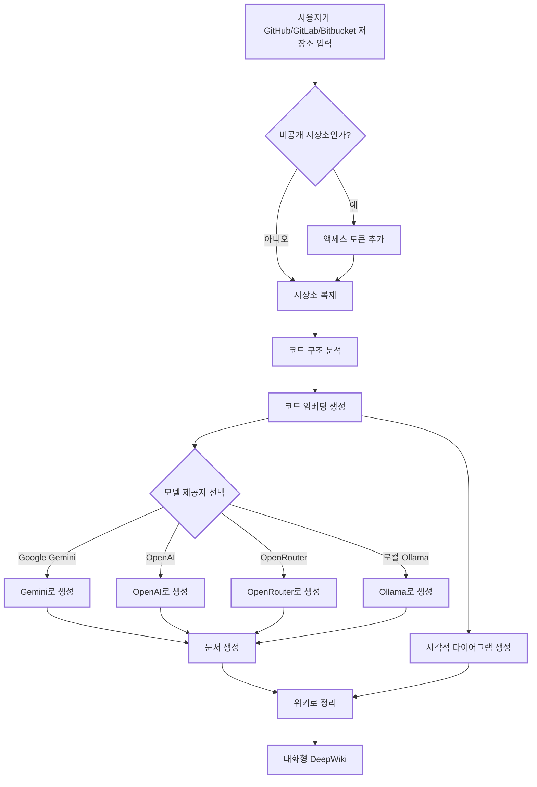

# DeepWiki-Open


**DeepWiki**는 제가 직접 구현한 프로젝트로, GitHub, GitLab 또는 BitBucket 저장소에 대해 아름답고 대화형 위키를 자동 생성합니다! 저장소 이름만 입력하면 DeepWiki가 다음을 수행합니다:

1. 코드 구조 분석
2. 포괄적인 문서 생성
3. 모든 작동 방식을 설명하는 시각적 다이어그램 생성
4. 이를 쉽게 탐색할 수 있는 위키로 정리

[](https://buymeacoffee.com/sheing)

[](https://x.com/sashimikun_void)
[](https://discord.com/invite/VQMBGR8u5v)

[English](./README.md) | [简体中文](./README.zh.md) | [日本語](./README.ja.md) | [Español](./README.es.md) | [한국어](./README.kr.md) | [Tiếng Việt](./README.vi.md) | [Português Brasileiro](./README.pt-br.md)

## ✨ 주요 기능

- **즉시 문서화**: 어떤 GitHub, GitLab 또는 BitBucket 저장소든 몇 초 만에 위키로 변환
- **비공개 저장소 지원**: 개인 액세스 토큰으로 비공개 저장소 안전하게 접근
- **스마트 분석**: AI 기반 코드 구조 및 관계 이해
- **아름다운 다이어그램**: 아키텍처와 데이터 흐름을 시각화하는 자동 Mermaid 다이어그램
- **쉬운 탐색**: 간단하고 직관적인 인터페이스로 위키 탐색 가능
- **Ask 기능**: RAG 기반 AI와 저장소에 대해 대화하며 정확한 답변 얻기
- **DeepResearch**: 복잡한 주제를 철저히 조사하는 다중 턴 연구 프로세스
- **다양한 모델 제공자 지원**: Google Gemini, OpenAI, OpenRouter, 로컬 Ollama 모델 지원

## 🚀 빠른 시작 (초간단!)

### 옵션 1: Docker 사용

```bash
# 저장소 클론
git clone https://github.com/AsyncFuncAI/deepwiki-open.git
cd deepwiki-open

# API 키를 포함한 .env 파일 생성
echo "GOOGLE_API_KEY=your_google_api_key" > .env
echo "OPENAI_API_KEY=your_openai_api_key" >> .env
# 선택 사항: OpenRouter 모델 사용 시 API 키 추가
echo "OPENROUTER_API_KEY=your_openrouter_api_key" >> .env

# Docker Compose로 실행
docker-compose up
```

> 💡 **API 키는 어디서 얻나요:**
> - [Google AI Studio](https://makersuite.google.com/app/apikey)에서 Google API 키 받기
> - [OpenAI 플랫폼](https://platform.openai.com/api-keys)에서 OpenAI API 키 받기

### 옵션 2: 수동 설정 (권장)

#### 1단계: API 키 설정

프로젝트 루트에 `.env` 파일을 만들고 다음 키들을 추가하세요:

```
GOOGLE_API_KEY=your_google_api_key
OPENAI_API_KEY=your_openai_api_key
# 선택 사항: OpenRouter 모델 사용 시 추가
OPENROUTER_API_KEY=your_openrouter_api_key
```

#### 2단계: 백엔드 시작

```bash
# Python 의존성 설치
pip install -r api/requirements.txt

# API 서버 실행
python -m api.main
```

#### 3단계: 프론트엔드 시작

```bash
# JavaScript 의존성 설치
npm install
# 또는
yarn install

# 웹 앱 실행
npm run dev
# 또는
yarn dev
```

#### 4단계: DeepWiki 사용하기!

1. 브라우저에서 [http://localhost:3000](http://localhost:3000) 열기
2. GitHub, GitLab 또는 Bitbucket 저장소 입력 (예: `https://github.com/openai/codex`, `https://github.com/microsoft/autogen`, `https://gitlab.com/gitlab-org/gitlab`, `https://bitbucket.org/redradish/atlassian_app_versions`)
3. 비공개 저장소인 경우 "+ 액세스 토큰 추가" 클릭 후 GitHub 또는 GitLab 개인 액세스 토큰 입력
4. "Generate Wiki" 클릭 후 마법을 지켜보기!

## 🔍 작동 방식

DeepWiki는 AI를 사용하여 다음을 수행합니다:

1. GitHub, GitLab 또는 Bitbucket 저장소 복제 및 분석 (토큰 인증이 필요한 비공개 저장소 포함)
2. 스마트 검색을 위한 코드 임베딩 생성
3. 문맥 인지 AI로 문서 생성 (Google Gemini, OpenAI, OpenRouter 또는 로컬 Ollama 모델 사용)
4. 코드 관계를 설명하는 시각적 다이어그램 생성
5. 모든 것을 구조화된 위키로 정리
6. Ask 기능을 통한 저장소와의 지능형 Q&A 지원
7. DeepResearch로 심층 연구 기능 제공



## 🛠️ 프로젝트 구조

```
deepwiki/
├── api/                  # 백엔드 API 서버
│   ├── main.py           # API 진입점
│   ├── api.py            # FastAPI 구현
│   ├── rag.py            # Retrieval Augmented Generation
│   ├── data_pipeline.py  # 데이터 처리 유틸리티
│   └── requirements.txt  # Python 의존성
│
├── src/                  # 프론트엔드 Next.js 앱
│   ├── app/              # Next.js 앱 디렉토리
│   │   └── page.tsx      # 메인 애플리케이션 페이지
│   └── components/       # React 컴포넌트
│       └── Mermaid.tsx   # Mermaid 다이어그램 렌더러
│
├── public/               # 정적 자산
├── package.json          # JavaScript 의존성
└── .env                  # 환경 변수 (직접 생성)
```

## 🛠️ 고급 설정

### 환경 변수

| 변수명 | 설명 | 필수 | 비고 |
|----------|-------------|----------|------|
| `GOOGLE_API_KEY` | AI 생성용 Google Gemini API 키 | 예 |
| `OPENAI_API_KEY` | 임베딩용 OpenAI API 키 | 예 |
| `OPENROUTER_API_KEY` | 대체 모델용 OpenRouter API 키 | 아니오 | OpenRouter 모델 사용 시 필요 |
| `PORT` | API 서버 포트 (기본값: 8001) | 아니오 | API와 프론트엔드를 같은 머신에서 호스팅 시 `SERVER_BASE_URL`의 포트도 변경 필요 |
| `SERVER_BASE_URL` | API 서버 기본 URL (기본값: http://localhost:8001) | 아니오 |

### 설정 파일

DeepWiki는 시스템의 다양한 측면을 관리하기 위해 JSON 설정 파일을 사용합니다:

1. **`generator.json`**: 텍스트 생성 모델 설정
   - 사용 가능한 모델 제공자(Google, OpenAI, OpenRouter, Ollama) 정의
   - 각 제공자의 기본 및 사용 가능한 모델 지정
   - temperature와 top_p 같은 모델별 매개변수 포함

2. **`embedder.json`**: 임베딩 모델 및 텍스트 처리 설정
   - 벡터 저장소용 임베딩 모델 정의
   - RAG를 위한 검색기 설정 포함
   - 문서 청킹을 위한 텍스트 분할기 설정 지정

3. **`repo.json`**: 저장소 처리 설정
   - 특정 파일 및 디렉토리를 제외하는 파일 필터 포함
   - 저장소 크기 제한 및 처리 규칙 정의

기본적으로 이러한 파일은 `api/config/` 디렉토리에 위치합니다. `DEEPWIKI_CONFIG_DIR` 환경 변수를 사용하여 위치를 사용자 정의할 수 있습니다.

### Docker 설정

Docker를 사용하여 DeepWiki를 실행할 수 있습니다:

```bash
# GitHub 컨테이너 레지스트리에서 이미지 가져오기
docker pull ghcr.io/asyncfuncai/deepwiki-open:latest

# 환경 변수와 함께 컨테이너 실행
docker run -p 8001:8001 -p 3000:3000 \
  -e GOOGLE_API_KEY=your_google_api_key \
  -e OPENAI_API_KEY=your_openai_api_key \
  -e OPENROUTER_API_KEY=your_openrouter_api_key \
  -v ~/.adalflow:/root/.adalflow \
  ghcr.io/asyncfuncai/deepwiki-open:latest
```

이 명령어는 또한 호스트의 `~/.adalflow`를 컨테이너의 `/root/.adalflow`에 마운트합니다. 이 경로는 다음을 저장하는 데 사용됩니다:
- 복제된 저장소 (`~/.adalflow/repos/`)
- 해당 저장소의 임베딩 및 인덱스 (`~/.adalflow/databases/`)
- 생성된 위키의 캐시 (`~/.adalflow/wikicache/`)

이를 통해 컨테이너가 중지되거나 제거되어도 데이터가 유지됩니다.

또는 제공된 `docker-compose.yml` 파일을 사용하세요:

```bash
# API 키가 포함된 .env 파일을 먼저 편집
docker-compose up
```

(`docker-compose.yml` 파일은 위의 `docker run` 명령어와 유사하게 데이터 지속성을 위해 `~/.adalflow`를 마운트하도록 미리 구성되어 있습니다.)

#### Docker에서 .env 파일 사용하기

.env 파일을 컨테이너에 마운트할 수도 있습니다:

```bash
# API 키가 포함된 .env 파일 생성
echo "GOOGLE_API_KEY=your_google_api_key" > .env
echo "OPENAI_API_KEY=your_openai_api_key" >> .env
echo "OPENROUTER_API_KEY=your_openrouter_api_key" >> .env

# .env 파일을 마운트하여 컨테이너 실행
docker run -p 8001:8001 -p 3000:3000 \
  -v $(pwd)/.env:/app/.env \
  -v ~/.adalflow:/root/.adalflow \
  ghcr.io/asyncfuncai/deepwiki-open:latest
```

이 명령어는 또한 호스트의 `~/.adalflow`를 컨테이너의 `/root/.adalflow`에 마운트합니다. 이 경로는 다음을 저장하는 데 사용됩니다:
- 복제된 저장소 (`~/.adalflow/repos/`)
- 해당 저장소의 임베딩 및 인덱스 (`~/.adalflow/databases/`)
- 생성된 위키의 캐시 (`~/.adalflow/wikicache/`)

이를 통해 컨테이너가 중지되거나 제거되어도 데이터가 유지됩니다.

#### 로컬에서 Docker 이미지 빌드하기

로컬에서 Docker 이미지를 빌드하려면:

```bash
# 저장소 클론
git clone https://github.com/AsyncFuncAI/deepwiki-open.git
cd deepwiki-open

# Docker 이미지 빌드
docker build -t deepwiki-open .

# 컨테이너 실행
docker run -p 8001:8001 -p 3000:3000 \
  -e GOOGLE_API_KEY=your_google_api_key \
  -e OPENAI_API_KEY=your_openai_api_key \
  -e OPENROUTER_API_KEY=your_openrouter_api_key \
  deepwiki-open
```

### API 서버 상세 정보

API 서버는 다음을 제공합니다:
- 저장소 복제 및 인덱싱
- RAG (Retrieval Augmented Generation)
- 스트리밍 채팅 완성

자세한 내용은 [API README](./api/README.md)를 참조하세요.

## 🤖 제공자 기반 모델 선택 시스템

DeepWiki는 이제 여러 LLM 제공자를 지원하는 유연한 제공자 기반 모델 선택 시스템을 구현했습니다:

### 지원되는 제공자 및 모델

- **Google**: 기본값 `gemini-2.0-flash`, 또한 `gemini-1.5-flash`, `gemini-1.0-pro` 등도 지원
- **OpenAI**: 기본값 `gpt-4o`, 또한 `o4-mini` 등도 지원
- **OpenRouter**: Claude, Llama, Mistral 등 통합 API를 통해 다양한 모델 접근 가능
- **Ollama**: `llama3`와 같은 로컬에서 실행되는 오픈소스 모델 지원

### 환경 변수

각 제공자는 해당 API 키 환경 변수가 필요합니다:

```
# API 키
GOOGLE_API_KEY=귀하의_구글_API_키        # Google Gemini 모델에 필요
OPENAI_API_KEY=귀하의_OpenAI_키         # OpenAI 모델에 필요
OPENROUTER_API_KEY=귀하의_OpenRouter_키 # OpenRouter 모델에 필요

# OpenAI API 기본 URL 구성
OPENAI_BASE_URL=https://사용자정의_API_엔드포인트.com/v1  # 선택 사항, 사용자 정의 OpenAI API 엔드포인트용
```

### 서비스 제공자를 위한 사용자 정의 모델 선택

사용자 정의 모델 선택 기능은 다음이 필요한 서비스 제공자를 위해 특별히 설계되었습니다:

- 귀하는 조직 내 사용자에게 다양한 AI 모델 선택 옵션을 제공할 수 있습니다
- 귀하는 코드 변경 없이 빠르게 진화하는 LLM 환경에 신속하게 적응할 수 있습니다
- 귀하는 사전 정의된 목록에 없는 특수하거나 미세 조정된 모델을 지원할 수 있습니다

서비스 제공자는 사전 정의된 옵션에서 선택하거나 프론트엔드 인터페이스에서 사용자 정의 모델 식별자를 입력하여 모델 제공을 구현할 수 있습니다.

### 기업 전용 채널을 위한 기본 URL 구성

OpenAI 클라이언트의 base_url 구성은 주로 비공개 API 채널이 있는 기업 사용자를 위해 설계되었습니다. 이 기능은:

- 비공개 또는 기업 전용 API 엔드포인트 연결 가능
- 조직이 자체 호스팅되거나 사용자 정의 배포된 LLM 서비스 사용 가능
- 서드파티 OpenAI API 호환 서비스와의 통합 지원

**출시 예정**: 향후 업데이트에서 DeepWiki는 사용자가 요청에서 자신의 API 키를 제공해야 하는 모드를 지원할 예정입니다. 이를 통해 비공개 채널이 있는 기업 고객은 DeepWiki 배포와 자격 증명을 공유하지 않고도 기존 API 구성을 사용할 수 있습니다.

## 🔌 OpenRouter 통합

DeepWiki는 이제 [OpenRouter](https://openrouter.ai/)를 모델 제공자로 지원하여, 단일 API를 통해 수백 개의 AI 모델에 접근할 수 있습니다:

- **다양한 모델 옵션**: OpenAI, Anthropic, Google, Meta, Mistral 등 다양한 모델 이용 가능
- **간편한 설정**: OpenRouter API 키만 추가하고 원하는 모델 선택
- **비용 효율성**: 예산과 성능에 맞는 모델 선택 가능
- **손쉬운 전환**: 코드 변경 없이 다양한 모델 간 전환 가능

### DeepWiki에서 OpenRouter 사용법

1. **API 키 받기**: [OpenRouter](https://openrouter.ai/) 가입 후 API 키 획득
2. **환경 변수 추가**: `.env` 파일에 `OPENROUTER_API_KEY=your_key` 추가
3. **UI에서 활성화**: 홈페이지에서 "Use OpenRouter API" 옵션 체크
4. **모델 선택**: GPT-4o, Claude 3.5 Sonnet, Gemini 2.0 등 인기 모델 선택

OpenRouter는 특히 다음과 같은 경우 유용합니다:
- 여러 서비스에 가입하지 않고 다양한 모델 시도
- 지역 제한이 있는 모델 접근
- 모델 제공자별 성능 비교
- 비용과 성능 최적화

## 🤖 Ask 및 DeepResearch 기능

### Ask 기능

Ask 기능은 Retrieval Augmented Generation (RAG)을 사용해 저장소와 대화할 수 있습니다:

- **문맥 인지 답변**: 저장소 내 실제 코드 기반으로 정확한 답변 제공
- **RAG 기반**: 관련 코드 조각을 검색해 근거 있는 답변 생성
- **실시간 스트리밍**: 답변 생성 과정을 실시간으로 확인 가능
- **대화 기록 유지**: 질문 간 문맥을 유지해 더 일관된 대화 가능

### DeepResearch 기능

DeepResearch는 다중 턴 연구 프로세스를 통해 저장소 분석을 한층 심화합니다:

- **심층 조사**: 여러 연구 반복을 통해 복잡한 주제 철저히 탐구
- **구조화된 프로세스**: 연구 계획, 업데이트, 최종 결론 단계로 진행
- **자동 연속 진행**: AI가 최대 5회 반복해 연구를 계속 진행
- **연구 단계**:
  1. **연구 계획**: 접근법과 초기 발견 사항 개요 작성
  2. **연구 업데이트**: 이전 반복 내용을 바탕으로 새로운 통찰 추가
  3. **최종 결론**: 모든 반복을 종합한 포괄적 답변 제공

DeepResearch를 사용하려면 질문 제출 전 Ask 인터페이스에서 "Deep Research" 스위치를 켜세요.

## 📱 스크린샷


*DeepWiki의 메인 인터페이스*


*개인 액세스 토큰으로 비공개 저장소 접근*


*DeepResearch는 복잡한 주제에 대해 다중 턴 조사를 수행*

### 데모 영상

[](https://youtu.be/zGANs8US8B4)

*DeepWiki 작동 영상 보기!*

## ❓ 문제 해결

### API 키 문제
- **"환경 변수 누락"**: `.env` 파일이 프로젝트 루트에 있고 필요한 API 키가 포함되어 있는지 확인
- **"API 키가 유효하지 않음"**: 키를 정확히 복사했는지, 공백이 없는지 확인
- **"OpenRouter API 오류"**: OpenRouter API 키가 유효하고 충분한 크레딧이 있는지 확인

### 연결 문제
- **"API 서버에 연결할 수 없음"**: API 서버가 포트 8001에서 실행 중인지 확인
- **"CORS 오류"**: API가 모든 출처를 허용하도록 설정되어 있지만 문제가 있으면 프론트엔드와 백엔드를 같은 머신에서 실행해 보세요

### 생성 문제
- **"위키 생성 오류"**: 아주 큰 저장소는 먼저 작은 저장소로 시도해 보세요
- **"잘못된 저장소 형식"**: 유효한 GitHub, GitLab 또는 Bitbucket URL 형식인지 확인
- **"저장소 구조를 가져올 수 없음"**: 비공개 저장소라면 적절한 권한의 개인 액세스 토큰을 입력했는지 확인
- **"다이어그램 렌더링 오류"**: 앱이 자동으로 다이어그램 오류를 수정하려 시도합니다

### 일반적인 해결법
1. **서버 둘 다 재시작**: 간단한 재시작으로 대부분 문제 해결
2. **콘솔 로그 확인**: 브라우저 개발자 도구에서 자바스크립트 오류 확인
3. **API 로그 확인**: API 실행 터미널에서 Python 오류 확인

## 🤝 기여

기여를 환영합니다! 다음을 자유롭게 해주세요:
- 버그나 기능 요청을 위한 이슈 열기
- 코드 개선을 위한 풀 리퀘스트 제출
- 피드백과 아이디어 공유

## 📄 라이선스

이 프로젝트는 MIT 라이선스 하에 있습니다 - 자세한 내용은 [LICENSE](LICENSE) 파일 참고.

## ⭐ 스타 히스토리

[](https://star-history.com/#AsyncFuncAI/deepwiki-open&Date)

