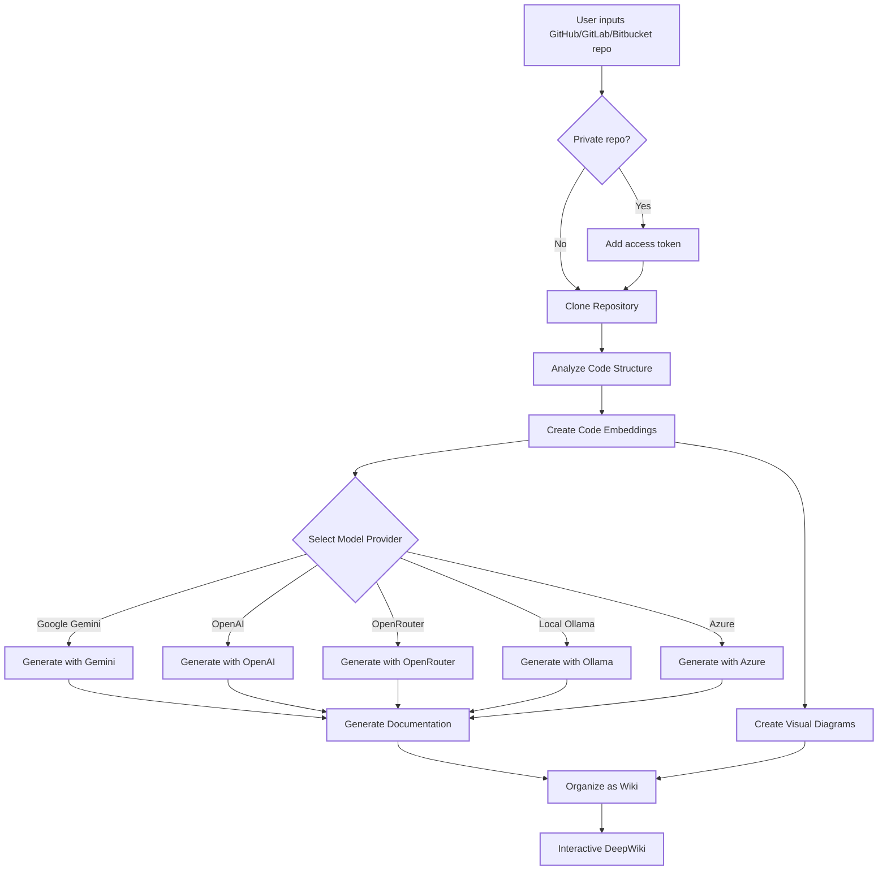

# DeepWiki-Open


**DeepWiki** is my own implementation attempt of DeepWiki, automatically creates beautiful, interactive wikis for any GitHub, GitLab, or BitBucket repository! Just enter a repo name, and DeepWiki will:

1. Analyze the code structure
2. Generate comprehensive documentation
3. Create visual diagrams to explain how everything works
4. Organize it all into an easy-to-navigate wiki

[](https://buymeacoffee.com/sheing)
[](https://tip.md/sng-asyncfunc)
[](https://x.com/sashimikun_void)
[](https://discord.com/invite/VQMBGR8u5v)

[English](./README.md) | [简体中文](./README.zh.md) | [繁體中文](./README.zh-tw.md) | [日本語](./README.ja.md) | [Español](./README.es.md) | [한국어](./README.kr.md) | [Tiếng Việt](./README.vi.md) | [Português Brasileiro](./README.pt-br.md)

## ✨ Features

- **Instant Documentation**: Turn any GitHub, GitLab or BitBucket repo into a wiki in seconds
- **Private Repository Support**: Securely access private repositories with personal access tokens
- **Smart Analysis**: AI-powered understanding of code structure and relationships
- **Beautiful Diagrams**: Automatic Mermaid diagrams to visualize architecture and data flow
- **Easy Navigation**: Simple, intuitive interface to explore the wiki
- **Ask Feature**: Chat with your repository using RAG-powered AI to get accurate answers
- **DeepResearch**: Multi-turn research process that thoroughly investigates complex topics
- **Multiple Model Providers**: Support for Google Gemini, OpenAI, OpenRouter, and local Ollama models

## 🚀 Quick Start (Super Easy!)

### Option 1: Using Docker

```bash
# Clone the repository
git clone https://github.com/AsyncFuncAI/deepwiki-open.git
cd deepwiki-open

# Create a .env file with your API keys
echo "GOOGLE_API_KEY=your_google_api_key" > .env
echo "OPENAI_API_KEY=your_openai_api_key" >> .env
# Optional: Add OpenRouter API key if you want to use OpenRouter models
echo "OPENROUTER_API_KEY=your_openrouter_api_key" >> .env
# Optional: Add Ollama host if not local. defaults to http://localhost:11434
echo "OLLAMA_HOST=your_ollama_host" >> .env
# Optional: Add Azure API key, endpoint and version if you want to use azure openai models
echo "AZURE_OPENAI_API_KEY=your_azure_openai_api_key" >> .env
echo "AZURE_OPENAI_ENDPOINT=your_azure_openai_endpoint" >> .env
echo "AZURE_OPENAI_VERSION=your_azure_openai_version" >> .env
# Run with Docker Compose
docker-compose up
```

For detailed instructions on using DeepWiki with Ollama and Docker, see [Ollama Instructions](Ollama-instruction.md).

> 💡 **Where to get these keys:**
> - Get a Google API key from [Google AI Studio](https://makersuite.google.com/app/apikey)
> - Get an OpenAI API key from [OpenAI Platform](https://platform.openai.com/api-keys)
> - Get Azure OpenAI credentials from [Azure Portal](https://portal.azure.com/) - create an Azure OpenAI resource and get the API key, endpoint, and API version

### Option 2: Manual Setup (Recommended)

#### Step 1: Set Up Your API Keys

Create a `.env` file in the project root with these keys:

```
GOOGLE_API_KEY=your_google_api_key
OPENAI_API_KEY=your_openai_api_key
# Optional: Add this if you want to use OpenRouter models
OPENROUTER_API_KEY=your_openrouter_api_key
# Optional: Add this if you want to use Azure OpenAI models
AZURE_OPENAI_API_KEY=your_azure_openai_api_key
AZURE_OPENAI_ENDPOINT=your_azure_openai_endpoint
AZURE_OPENAI_VERSION=your_azure_openai_version
# Optional: Add Ollama host if not local. default: http://localhost:11434
OLLAMA_HOST=your_ollama_host
```

#### Step 2: Start the Backend

```bash
# Install Python dependencies
pip install -r api/requirements.txt

# Start the API server
python -m api.main
```

#### Step 3: Start the Frontend

```bash
# Install JavaScript dependencies
npm install
# or
yarn install

# Start the web app
npm run dev
# or
yarn dev
```

#### Step 4: Use DeepWiki!

1. Open [http://localhost:3000](http://localhost:3000) in your browser
2. Enter a GitHub, GitLab, or Bitbucket repository (like `https://github.com/openai/codex`, `https://github.com/microsoft/autogen`, `https://gitlab.com/gitlab-org/gitlab`, or `https://bitbucket.org/redradish/atlassian_app_versions`)
3. For private repositories, click "+ Add access tokens" and enter your GitHub or GitLab personal access token
4. Click "Generate Wiki" and watch the magic happen!

## 🔍 How It Works

DeepWiki uses AI to:

1. Clone and analyze the GitHub, GitLab, or Bitbucket repository (including private repos with token authentication)
2. Create embeddings of the code for smart retrieval
3. Generate documentation with context-aware AI (using Google Gemini, OpenAI, OpenRouter, Azure OpenAI, or local Ollama models)
4. Create visual diagrams to explain code relationships
5. Organize everything into a structured wiki
6. Enable intelligent Q&A with the repository through the Ask feature
7. Provide in-depth research capabilities with DeepResearch



## 🛠️ Project Structure

```
deepwiki/
├── api/                  # Backend API server
│   ├── main.py           # API entry point
│   ├── api.py            # FastAPI implementation
│   ├── rag.py            # Retrieval Augmented Generation
│   ├── data_pipeline.py  # Data processing utilities
│   └── requirements.txt  # Python dependencies
│
├── src/                  # Frontend Next.js app
│   ├── app/              # Next.js app directory
│   │   └── page.tsx      # Main application page
│   └── components/       # React components
│       └── Mermaid.tsx   # Mermaid diagram renderer
│
├── public/               # Static assets
├── package.json          # JavaScript dependencies
└── .env                  # Environment variables (create this)
```

## 🤖 Provider-Based Model Selection System

DeepWiki now implements a flexible provider-based model selection system supporting multiple LLM providers:

### Supported Providers and Models

- **Google**: Default `gemini-2.0-flash`, also supports `gemini-1.5-flash`, `gemini-1.0-pro`, etc.
- **OpenAI**: Default `gpt-4o`, also supports `o4-mini`, etc.
- **OpenRouter**: Access to multiple models via a unified API, including Claude, Llama, Mistral, etc.
- **Azure OpenAI**: Default `gpt-4o`, also supports `o4-mini`, etc.
- **Ollama**: Support for locally running open-source models like `llama3`

### Environment Variables

Each provider requires its corresponding API key environment variables:

```
# API Keys
GOOGLE_API_KEY=your_google_api_key        # Required for Google Gemini models
OPENAI_API_KEY=your_openai_api_key        # Required for OpenAI models
OPENROUTER_API_KEY=your_openrouter_api_key # Required for OpenRouter models
AZURE_OPENAI_API_KEY=your_azure_openai_api_key  #Required for Azure OpenAI models
AZURE_OPENAI_ENDPOINT=your_azure_openai_endpoint  #Required for Azure OpenAI models
AZURE_OPENAI_VERSION=your_azure_openai_version  #Required for Azure OpenAI models

# OpenAI API Base URL Configuration
OPENAI_BASE_URL=https://custom-api-endpoint.com/v1  # Optional, for custom OpenAI API endpoints

# Ollama host
OLLAMA_HOST=your_ollama_host # Optional, if Ollama is not local. default: http://localhost:11434

# Configuration Directory
DEEPWIKI_CONFIG_DIR=/path/to/custom/config/dir  # Optional, for custom config file location
```

### Configuration Files

DeepWiki uses JSON configuration files to manage various aspects of the system:

1. **`generator.json`**: Configuration for text generation models
   - Defines available model providers (Google, OpenAI, OpenRouter, Azure, Ollama)
   - Specifies default and available models for each provider
   - Contains model-specific parameters like temperature and top_p

2. **`embedder.json`**: Configuration for embedding models and text processing
   - Defines embedding models for vector storage
   - Contains retriever configuration for RAG
   - Specifies text splitter settings for document chunking

3. **`repo.json`**: Configuration for repository handling
   - Contains file filters to exclude certain files and directories
   - Defines repository size limits and processing rules

By default, these files are located in the `api/config/` directory. You can customize their location using the `DEEPWIKI_CONFIG_DIR` environment variable.

### Custom Model Selection for Service Providers

The custom model selection feature is specifically designed for service providers who need to:

- You can offer multiple AI model choices to users within your organization
- You can quickly adapt to the rapidly evolving LLM landscape without code changes
- You can support specialized or fine-tuned models that aren't in the predefined list

Service providers can implement their model offerings by selecting from the predefined options or entering custom model identifiers in the frontend interface.

### Base URL Configuration for Enterprise Private Channels

The OpenAI Client's base_url configuration is designed primarily for enterprise users with private API channels. This feature:

- Enables connection to private or enterprise-specific API endpoints
- Allows organizations to use their own self-hosted or custom-deployed LLM services
- Supports integration with third-party OpenAI API-compatible services

**Coming Soon**: In future updates, DeepWiki will support a mode where users need to provide their own API keys in requests. This will allow enterprise customers with private channels to use their existing API arrangements without sharing credentials with the DeepWiki deployment.

## 🧩 Using OpenAI-Compatible Embedding Models (e.g., Alibaba Qwen)

If you want to use embedding models compatible with the OpenAI API (such as Alibaba Qwen), follow these steps:

1. Replace the contents of `api/config/embedder.json` with those from `api/config/embedder_openai_compatible.json`.
2. In your project root `.env` file, set the relevant environment variables, for example:
   ```
   OPENAI_API_KEY=your_api_key
   OPENAI_API_BASE_URL=your_openai_compatible_endpoint
   ```
3. The program will automatically substitute placeholders in embedder.json with the values from your environment variables.

This allows you to seamlessly switch to any OpenAI-compatible embedding service without code changes.

### Logging

DeepWiki uses Python's built-in `logging` module for diagnostic output. You can configure the verbosity and log file destination via environment variables:

| Variable        | Description                                                        | Default                      |
|-----------------|--------------------------------------------------------------------|------------------------------|
| `LOG_LEVEL`     | Logging level (DEBUG, INFO, WARNING, ERROR, CRITICAL).             | INFO                         |
| `LOG_FILE_PATH` | Path to the log file. If set, logs will be written to this file.   | `api/logs/application.log`   |

To enable debug logging and direct logs to a custom file:
```bash
export LOG_LEVEL=DEBUG
export LOG_FILE_PATH=./debug.log
python -m api.main
```
Or with Docker Compose:
```bash
LOG_LEVEL=DEBUG LOG_FILE_PATH=./debug.log docker-compose up
```

When running with Docker Compose, the container's `api/logs` directory is bind-mounted to `./api/logs` on your host (see the `volumes` section in `docker-compose.yml`), ensuring log files persist across restarts.

Alternatively, you can store these settings in your `.env` file:

```bash
LOG_LEVEL=DEBUG
LOG_FILE_PATH=./debug.log
```
Then simply run:

```bash
docker-compose up
```

**Logging Path Security Considerations:** In production environments, ensure the `api/logs` directory and any custom log file path are secured with appropriate filesystem permissions and access controls. The application enforces that `LOG_FILE_PATH` resides within the project's `api/logs` directory to prevent path traversal or unauthorized writes.

## 🛠️ Advanced Setup

### Environment Variables

| Variable             | Description                                                  | Required | Note                                                                                                     |
|----------------------|--------------------------------------------------------------|----------|----------------------------------------------------------------------------------------------------------|
| `GOOGLE_API_KEY`     | Google Gemini API key for AI generation                      | No | Required only if you want to use Google Gemini models                                                    
| `OPENAI_API_KEY`     | OpenAI API key for embeddings                                | Yes | Note: This is required even if you're not using OpenAI models, as it's used for embeddings.              |
| `OPENROUTER_API_KEY` | OpenRouter API key for alternative models                    | No | Required only if you want to use OpenRouter models                                                       |
| `AZURE_OPENAI_API_KEY` | Azure OpenAI API key                    | No | Required only if you want to use Azure OpenAI models                                                       |
| `AZURE_OPENAI_ENDPOINT` | Azure OpenAI endpoint                    | No | Required only if you want to use Azure OpenAI models                                                       |
| `AZURE_OPENAI_VERSION` | Azure OpenAI version                     | No | Required only if you want to use Azure OpenAI models                                                       |
| `OLLAMA_HOST`        | Ollama Host (default: http://localhost:11434)                | No | Required only if you want to use external Ollama server                                                  |
| `PORT`               | Port for the API server (default: 8001)                      | No | If you host API and frontend on the same machine, make sure change port of `SERVER_BASE_URL` accordingly |
| `SERVER_BASE_URL`    | Base URL for the API server (default: http://localhost:8001) | No |
| `DEEPWIKI_AUTH_MODE` | Set to `true` or `1` to enable authorization mode. | No | Defaults to `false`. If enabled, `DEEPWIKI_AUTH_CODE` is required. |
| `DEEPWIKI_AUTH_CODE` | The secret code required for wiki generation when `DEEPWIKI_AUTH_MODE` is enabled. | No | Only used if `DEEPWIKI_AUTH_MODE` is `true` or `1`. |

If you're not using ollama mode, you need to configure an OpenAI API key for embeddings. Other API keys are only required when configuring and using models from the corresponding providers.

## Authorization Mode

DeepWiki can be configured to run in an authorization mode, where wiki generation requires a valid authorization code. This is useful if you want to control who can use the generation feature.
Restricts frontend initiation and protects cache deletion, but doesn't fully prevent backend generation if API endpoints are hit directly.

To enable authorization mode, set the following environment variables:

- `DEEPWIKI_AUTH_MODE`: Set this to `true` or `1`. When enabled, the frontend will display an input field for the authorization code.
- `DEEPWIKI_AUTH_CODE`: Set this to the desired secret code. Restricts frontend initiation and protects cache deletion, but doesn't fully prevent backend generation if API endpoints are hit directly.

If `DEEPWIKI_AUTH_MODE` is not set or is set to `false` (or any other value than `true`/`1`), the authorization feature will be disabled, and no code will be required.

### Docker Setup

You can use Docker to run DeepWiki:

#### Running the Container

```bash
# Pull the image from GitHub Container Registry
docker pull ghcr.io/asyncfuncai/deepwiki-open:latest

# Run the container with environment variables
docker run -p 8001:8001 -p 3000:3000 \
  -e GOOGLE_API_KEY=your_google_api_key \
  -e OPENAI_API_KEY=your_openai_api_key \
  -e OPENROUTER_API_KEY=your_openrouter_api_key \
  -e OLLAMA_HOST=your_ollama_host \
  -e AZURE_OPENAI_API_KEY=your_azure_openai_api_key \
  -e AZURE_OPENAI_ENDPOINT=your_azure_openai_endpoint \
  -e AZURE_OPENAI_VERSION=your_azure_openai_version \

  -v ~/.adalflow:/root/.adalflow \
  ghcr.io/asyncfuncai/deepwiki-open:latest
```

This command also mounts `~/.adalflow` on your host to `/root/.adalflow` in the container. This path is used to store:
- Cloned repositories (`~/.adalflow/repos/`)
- Their embeddings and indexes (`~/.adalflow/databases/`)
- Cached generated wiki content (`~/.adalflow/wikicache/`)

This ensures that your data persists even if the container is stopped or removed.

Or use the provided `docker-compose.yml` file:

```bash
# Edit the .env file with your API keys first
docker-compose up
```

(The `docker-compose.yml` file is pre-configured to mount `~/.adalflow` for data persistence, similar to the `docker run` command above.)

#### Using a .env file with Docker

You can also mount a .env file to the container:

```bash
# Create a .env file with your API keys
echo "GOOGLE_API_KEY=your_google_api_key" > .env
echo "OPENAI_API_KEY=your_openai_api_key" >> .env
echo "OPENROUTER_API_KEY=your_openrouter_api_key" >> .env
echo "AZURE_OPENAI_API_KEY=your_azure_openai_api_key" >> .env
echo "AZURE_OPENAI_ENDPOINT=your_azure_openai_endpoint" >> .env
echo "AZURE_OPENAI_VERSION=your_azure_openai_version"  >>.env
echo "OLLAMA_HOST=your_ollama_host" >> .env

# Run the container with the .env file mounted
docker run -p 8001:8001 -p 3000:3000 \
  -v $(pwd)/.env:/app/.env \
  -v ~/.adalflow:/root/.adalflow \
  ghcr.io/asyncfuncai/deepwiki-open:latest
```

This command also mounts `~/.adalflow` on your host to `/root/.adalflow` in the container. This path is used to store:
- Cloned repositories (`~/.adalflow/repos/`)
- Their embeddings and indexes (`~/.adalflow/databases/`)
- Cached generated wiki content (`~/.adalflow/wikicache/`)

This ensures that your data persists even if the container is stopped or removed.

#### Building the Docker image locally

If you want to build the Docker image locally:

```bash
# Clone the repository
git clone https://github.com/AsyncFuncAI/deepwiki-open.git
cd deepwiki-open

# Build the Docker image
docker build -t deepwiki-open .

# Run the container
docker run -p 8001:8001 -p 3000:3000 \
  -e GOOGLE_API_KEY=your_google_api_key \
  -e OPENAI_API_KEY=your_openai_api_key \
  -e OPENROUTER_API_KEY=your_openrouter_api_key \
  -e AZURE_OPENAI_API_KEY=your_azure_openai_api_key \
  -e AZURE_OPENAI_ENDPOINT=your_azure_openai_endpoint \
  -e AZURE_OPENAI_VERSION=your_azure_openai_version \
  -e OLLAMA_HOST=your_ollama_host \
  deepwiki-open
```

#### Using Self-Signed Certificates in Docker

If you're in an environment that uses self-signed certificates, you can include them in the Docker build:

1. Create a directory for your certificates (default is `certs` in your project root)
2. Copy your `.crt` or `.pem` certificate files into this directory
3. Build the Docker image:

```bash
# Build with default certificates directory (certs)
docker build .

# Or build with a custom certificates directory
docker build --build-arg CUSTOM_CERT_DIR=my-custom-certs .
```

### API Server Details

The API server provides:
- Repository cloning and indexing
- RAG (Retrieval Augmented Generation)
- Streaming chat completions

For more details, see the [API README](./api/README.md).

## 🔌 OpenRouter Integration

DeepWiki now supports [OpenRouter](https://openrouter.ai/) as a model provider, giving you access to hundreds of AI models through a single API:

- **Multiple Model Options**: Access models from OpenAI, Anthropic, Google, Meta, Mistral, and more
- **Simple Configuration**: Just add your OpenRouter API key and select the model you want to use
- **Cost Efficiency**: Choose models that fit your budget and performance needs
- **Easy Switching**: Toggle between different models without changing your code

### How to Use OpenRouter with DeepWiki

1. **Get an API Key**: Sign up at [OpenRouter](https://openrouter.ai/) and get your API key
2. **Add to Environment**: Add `OPENROUTER_API_KEY=your_key` to your `.env` file
3. **Enable in UI**: Check the "Use OpenRouter API" option on the homepage
4. **Select Model**: Choose from popular models like GPT-4o, Claude 3.5 Sonnet, Gemini 2.0, and more

OpenRouter is particularly useful if you want to:
- Try different models without signing up for multiple services
- Access models that might be restricted in your region
- Compare performance across different model providers
- Optimize for cost vs. performance based on your needs

## 🤖 Ask & DeepResearch Features

### Ask Feature

The Ask feature allows you to chat with your repository using Retrieval Augmented Generation (RAG):

- **Context-Aware Responses**: Get accurate answers based on the actual code in your repository
- **RAG-Powered**: The system retrieves relevant code snippets to provide grounded responses
- **Real-Time Streaming**: See responses as they're generated for a more interactive experience
- **Conversation History**: The system maintains context between questions for more coherent interactions

### DeepResearch Feature

DeepResearch takes repository analysis to the next level with a multi-turn research process:

- **In-Depth Investigation**: Thoroughly explores complex topics through multiple research iterations
- **Structured Process**: Follows a clear research plan with updates and a comprehensive conclusion
- **Automatic Continuation**: The AI automatically continues research until reaching a conclusion (up to 5 iterations)
- **Research Stages**:
  1. **Research Plan**: Outlines the approach and initial findings
  2. **Research Updates**: Builds on previous iterations with new insights
  3. **Final Conclusion**: Provides a comprehensive answer based on all iterations

To use DeepResearch, simply toggle the "Deep Research" switch in the Ask interface before submitting your question.

## 📱 Screenshots


*The main interface of DeepWiki*


*Access private repositories with personal access tokens*


*DeepResearch conducts multi-turn investigations for complex topics*

### Demo Video

[](https://youtu.be/zGANs8US8B4)

*Watch DeepWiki in action!*

## ❓ Troubleshooting

### API Key Issues
- **"Missing environment variables"**: Make sure your `.env` file is in the project root and contains the required API keys
- **"API key not valid"**: Check that you've copied the full key correctly with no extra spaces
- **"OpenRouter API error"**: Verify your OpenRouter API key is valid and has sufficient credits
- **"Azure OpenAI API error"**: Verify your Azure OpenAI credentials (API key, endpoint, and version) are correct and the service is properly deployed

### Connection Problems
- **"Cannot connect to API server"**: Make sure the API server is running on port 8001
- **"CORS error"**: The API is configured to allow all origins, but if you're having issues, try running both frontend and backend on the same machine

### Generation Issues
- **"Error generating wiki"**: For very large repositories, try a smaller one first
- **"Invalid repository format"**: Make sure you're using a valid GitHub, GitLab or Bitbucket URL format
- **"Could not fetch repository structure"**: For private repositories, ensure you've entered a valid personal access token with appropriate permissions
- **"Diagram rendering error"**: The app will automatically try to fix broken diagrams

### Common Solutions
1. **Restart both servers**: Sometimes a simple restart fixes most issues
2. **Check console logs**: Open browser developer tools to see any JavaScript errors
3. **Check API logs**: Look at the terminal where the API is running for Python errors

## 🤝 Contributing

Contributions are welcome! Feel free to:
- Open issues for bugs or feature requests
- Submit pull requests to improve the code
- Share your feedback and ideas

## 📄 License

This project is licensed under the MIT License - see the [LICENSE](LICENSE) file for details.

## ⭐ Star History

[](https://star-history.com/#AsyncFuncAI/deepwiki-open&Date)
