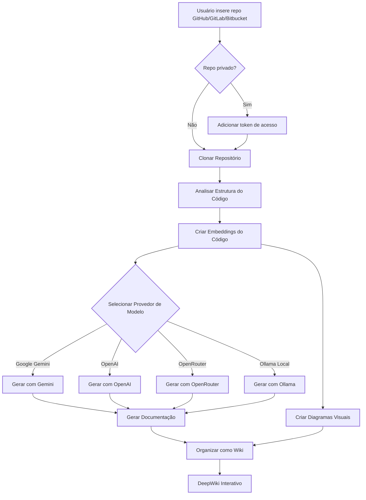

# DeepWiki-Open


**DeepWiki** é minha própria tentativa de implementação do DeepWiki, que cria automaticamente wikis bonitas e interativas para qualquer repositório GitHub, GitLab ou BitBucket! Basta inserir o nome de um repositório, e o DeepWiki irá:

1. Analisar a estrutura do código
2. Gerar documentação abrangente
3. Criar diagramas visuais para explicar como tudo funciona
4. Organizar tudo em uma wiki fácil de navegar

[](https://buymeacoffee.com/sheing)
[](https://tip.md/sng-asyncfunc)
[](https://x.com/sashimikun_void)
[](https://discord.com/invite/VQMBGR8u5v)

[English](./README.md) | [简体中文](./README.zh.md) | [日本語](./README.ja.md) | [Español](./README.es.md) | [한국어](./README.kr.md) | [Tiếng Việt](./README.vi.md) | [Português Brasileiro](./README.pt-br.md)

## ✨ Recursos

- **Documentação Instantânea**: Transforme qualquer repositório GitHub, GitLab ou BitBucket em uma wiki em segundos
- **Suporte a Repositórios Privados**: Acesse repositórios privados com segurança usando tokens de acesso pessoal
- **Análise Inteligente**: Compreensão da estrutura e relacionamentos do código com IA
- **Diagramas Bonitos**: Diagramas Mermaid automáticos para visualizar arquitetura e fluxo de dados
- **Navegação Fácil**: Interface simples e intuitiva para explorar a wiki
- **Recurso de Perguntas**: Converse com seu repositório usando IA com RAG para obter respostas precisas
- **DeepResearch**: Processo de pesquisa em várias etapas que investiga minuciosamente tópicos complexos
- **Múltiplos Provedores de Modelos**: Suporte para Google Gemini, OpenAI, OpenRouter e modelos locais Ollama

## 🚀 Início Rápido (Super Fácil!)

### Opção 1: Usando Docker

```bash
# Clone o repositório
git clone https://github.com/AsyncFuncAI/deepwiki-open.git
cd deepwiki-open

# Crie um arquivo .env com suas chaves de API
echo "GOOGLE_API_KEY=sua_chave_api_google" > .env
echo "OPENAI_API_KEY=sua_chave_api_openai" >> .env
# Opcional: Adicione a chave API OpenRouter se quiser usar modelos OpenRouter
echo "OPENROUTER_API_KEY=sua_chave_api_openrouter" >> .env
# Opcional: Adicione o host Ollama se não for local. padrão: http://localhost:11434
echo "OLLAMA_HOST=seu_host_ollama" >> .env

# Execute com Docker Compose
docker-compose up
```

Para instruções detalhadas sobre como usar o DeepWiki com Ollama e Docker, veja [Instruções do Ollama (em inglês)](Ollama-instruction.md).

> 💡 **Onde obter essas chaves:**
> - Obtenha uma chave API Google no [Google AI Studio](https://makersuite.google.com/app/apikey)
> - Obtenha uma chave API OpenAI na [Plataforma OpenAI](https://platform.openai.com/api-keys)

### Opção 2: Configuração Manual (Recomendada)

#### Passo 1: Configure Suas Chaves API

Crie um arquivo `.env` na raiz do projeto com estas chaves:

```
GOOGLE_API_KEY=sua_chave_api_google
OPENAI_API_KEY=sua_chave_api_openai
# Opcional: Adicione isso se quiser usar modelos OpenRouter
OPENROUTER_API_KEY=sua_chave_api_openrouter
# Opcional: Adicione o host Ollama se não for local. padrão: http://localhost:11434
OLLAMA_HOST=seu_host_ollama
```

#### Passo 2: Inicie o Backend

```bash
# Instale as dependências Python
pip install -r api/requirements.txt

# Inicie o servidor API
python -m api.main
```

#### Passo 3: Inicie o Frontend

```bash
# Instale as dependências JavaScript
npm install
# ou
yarn install

# Inicie o aplicativo web
npm run dev
# ou
yarn dev
```

#### Passo 4: Use o DeepWiki!

1. Abra [http://localhost:3000](http://localhost:3000) no seu navegador
2. Insira um repositório GitHub, GitLab ou Bitbucket (como `https://github.com/openai/codex`, `https://github.com/microsoft/autogen`, `https://gitlab.com/gitlab-org/gitlab`, ou `https://bitbucket.org/redradish/atlassian_app_versions`)
3. Para repositórios privados, clique em "+ Adicionar tokens de acesso" e insira seu token de acesso pessoal do GitHub ou GitLab
4. Clique em "Gerar Wiki" e veja a mágica acontecer!

## 🔍 Como Funciona

O DeepWiki usa IA para:

1. Clonar e analisar o repositório GitHub, GitLab ou Bitbucket (incluindo repositórios privados com autenticação por token)
2. Criar embeddings do código para recuperação inteligente
3. Gerar documentação com IA contextual (usando modelos Google Gemini, OpenAI, OpenRouter ou Ollama local)
4. Criar diagramas visuais para explicar relações de código
5. Organizar tudo em uma wiki estruturada
6. Permitir perguntas e respostas inteligentes com o repositório através do recurso de Perguntas
7. Fornecer capacidades de pesquisa aprofundada com DeepResearch



## 🛠️ Estrutura do Projeto

```
deepwiki/
├── api/                  # Servidor API backend
│   ├── main.py           # Ponto de entrada da API
│   ├── api.py            # Implementação FastAPI
│   ├── rag.py            # Retrieval Augmented Generation
│   ├── data_pipeline.py  # Utilitários de processamento de dados
│   └── requirements.txt  # Dependências Python
│
├── src/                  # Aplicativo Next.js frontend
│   ├── app/              # Diretório do aplicativo Next.js
│   │   └── page.tsx      # Página principal do aplicativo
│   └── components/       # Componentes React
│       └── Mermaid.tsx   # Renderizador de diagramas Mermaid
│
├── public/               # Ativos estáticos
├── package.json          # Dependências JavaScript
└── .env                  # Variáveis de ambiente (crie este arquivo)
```

## 🤖 Sistema de Seleção de Modelos Baseado em Provedores

O DeepWiki agora implementa um sistema flexível de seleção de modelos baseado em provedores, suportando múltiplos provedores de LLM:

### Provedores e Modelos Suportados

- **Google**: Padrão `gemini-2.0-flash`, também suporta `gemini-1.5-flash`, `gemini-1.0-pro`, etc.
- **OpenAI**: Padrão `gpt-4o`, também suporta `o4-mini`, etc.
- **OpenRouter**: Acesso a múltiplos modelos via uma API unificada, incluindo Claude, Llama, Mistral, etc.
- **Ollama**: Suporte para modelos de código aberto executados localmente como `llama3`

### Variáveis de Ambiente

Cada provedor requer suas variáveis de ambiente de chave API correspondentes:

```
# Chaves API
GOOGLE_API_KEY=sua_chave_api_google        # Necessária para modelos Google Gemini
OPENAI_API_KEY=sua_chave_api_openai        # Necessária para modelos OpenAI
OPENROUTER_API_KEY=sua_chave_api_openrouter # Necessária para modelos OpenRouter

# Configuração de URL Base da API OpenAI
OPENAI_BASE_URL=https://endpoint-api-personalizado.com/v1  # Opcional, para endpoints de API OpenAI personalizados

# Host Ollama
OLLAMA_HOST=seu_host_ollama # Opcional, se Ollama não for local. padrão: http://localhost:11434

# Diretório de Configuração
DEEPWIKI_CONFIG_DIR=/caminho/para/dir/config/personalizado  # Opcional, para localização personalizada de arquivos de configuração
```

### Arquivos de Configuração

O DeepWiki usa arquivos de configuração JSON para gerenciar vários aspectos do sistema:

1. **`generator.json`**: Configuração para modelos de geração de texto
   - Define provedores de modelos disponíveis (Google, OpenAI, OpenRouter, Ollama)
   - Especifica modelos padrão e disponíveis para cada provedor
   - Contém parâmetros específicos de modelo como temperatura e top_p

2. **`embedder.json`**: Configuração para modelos de embedding e processamento de texto
   - Define modelos de embedding para armazenamento de vetores
   - Contém configuração do recuperador para RAG
   - Especifica configurações do divisor de texto para divisão de documentos

3. **`repo.json`**: Configuração para manipulação de repositórios
   - Contém filtros de arquivos para excluir certos arquivos e diretórios
   - Define limites de tamanho de repositório e regras de processamento

Por padrão, esses arquivos estão localizados no diretório `api/config/`. Você pode personalizar sua localização usando a variável de ambiente `DEEPWIKI_CONFIG_DIR`.

### Seleção de Modelo Personalizado para Provedores de Serviço

O recurso de seleção de modelo personalizado é especificamente projetado para provedores de serviço que precisam:

- Oferecer múltiplas opções de modelo de IA para usuários dentro de sua organização
- Adaptar-se rapidamente ao panorama de LLM em rápida evolução sem mudanças de código
- Suportar modelos especializados ou ajustados que não estão na lista predefinida

Provedores de serviço podem implementar suas ofertas de modelo selecionando entre as opções predefinidas ou inserindo identificadores de modelo personalizados na interface do frontend.

### Configuração de URL Base para Canais Privados Empresariais

A configuração base_url do Cliente OpenAI é projetada principalmente para usuários empresariais com canais de API privados. Este recurso:

- Permite conexão a endpoints de API privados ou específicos da empresa
- Permite que organizações usem seus próprios serviços LLM auto-hospedados ou implantados personalizados
- Suporta integração com serviços compatíveis com a API OpenAI de terceiros

**Em Breve**: Em atualizações futuras, o DeepWiki suportará um modo onde os usuários precisam fornecer suas próprias chaves API nas solicitações. Isso permitirá que clientes empresariais com canais privados usem seus arranjos de API existentes sem compartilhar credenciais com a implantação do DeepWiki.

## 🤩 Usando Modelos de Embedding Compatíveis com OpenAI (ex., Alibaba Qwen)

Se você deseja usar modelos de embedding compatíveis com a API OpenAI (como Alibaba Qwen), siga estas etapas:

1. Substitua o conteúdo de `api/config/embedder.json` pelo de `api/config/embedder_openai_compatible.json`.
2. No arquivo `.env` da raiz do seu projeto, defina as variáveis de ambiente relevantes, por exemplo:
   ```
   OPENAI_API_KEY=sua_chave_api
   OPENAI_API_BASE_URL=seu_endpoint_compativel_openai
   ```
3. O programa substituirá automaticamente os espaços reservados em embedder.json pelos valores de suas variáveis de ambiente.

Isso permite que você mude perfeitamente para qualquer serviço de embedding compatível com OpenAI sem mudanças de código.

### Logging

O DeepWiki usa o módulo `logging` integrado do Python para saída de diagnóstico. Você pode configurar a verbosidade e o destino do arquivo de log via variáveis de ambiente:

| Variável        | Descrição                                                        | Padrão                      |
|-----------------|--------------------------------------------------------------------|------------------------------|
| `LOG_LEVEL`     | Nível de logging (DEBUG, INFO, WARNING, ERROR, CRITICAL).          | INFO                         |
| `LOG_FILE_PATH` | Caminho para o arquivo de log. Se definido, logs serão escritos neste arquivo. | `api/logs/application.log`   |

Para habilitar logging de depuração e direcionar logs para um arquivo personalizado:
```bash
export LOG_LEVEL=DEBUG
export LOG_FILE_PATH=./debug.log
python -m api.main
```
Ou com Docker Compose:
```bash
LOG_LEVEL=DEBUG LOG_FILE_PATH=./debug.log docker-compose up
```

Ao executar com Docker Compose, o diretório `api/logs` do container é montado em `./api/logs` no seu host (veja a seção `volumes` em `docker-compose.yml`), garantindo que os arquivos de log persistam entre reinicializações.

Alternativamente, você pode armazenar essas configurações no seu arquivo `.env`:

```bash
LOG_LEVEL=DEBUG
LOG_FILE_PATH=./debug.log
```
Então simplesmente execute:

```bash
docker-compose up
```

**Considerações de Segurança do Caminho de Logging:** Em ambientes de produção, garanta que o diretório `api/logs` e qualquer caminho de arquivo de log personalizado estejam protegidos com permissões de sistema de arquivos e controles de acesso apropriados. O aplicativo impõe que `LOG_FILE_PATH` resida dentro do diretório `api/logs` do projeto para evitar travessia de caminho ou escritas não autorizadas.

## 🔧 Configuração Avançada

### Variáveis de Ambiente

| Variável             | Descrição                                                  | Obrigatória | Observação                                                                                                     |
|----------------------|--------------------------------------------------------------|----------|----------------------------------------------------------------------------------------------------------|
| `GOOGLE_API_KEY`     | Chave API Google Gemini para geração com IA                      | Não | Necessária apenas se você quiser usar modelos Google Gemini                                                    
| `OPENAI_API_KEY`     | Chave API OpenAI para embeddings                                | Sim | Nota: Isso é necessário mesmo se você não estiver usando modelos OpenAI, pois é usado para embeddings.              |
| `OPENROUTER_API_KEY` | Chave API OpenRouter para modelos alternativos                    | Não | Necessária apenas se você quiser usar modelos OpenRouter                                                       |
| `OLLAMA_HOST`        | Host Ollama (padrão: http://localhost:11434)                | Não | Necessária apenas se você quiser usar servidor Ollama externo                                                  |
| `PORT`               | Porta para o servidor API (padrão: 8001)                      | Não | Se você hospedar API e frontend na mesma máquina, certifique-se de alterar a porta de `SERVER_BASE_URL` de acordo |
| `SERVER_BASE_URL`    | URL base para o servidor API (padrão: http://localhost:8001) | Não |
| `DEEPWIKI_AUTH_MODE` | Defina como `true` ou `1` para habilitar o modo de autorização. | Não | Padrão é `false`. Se habilitado, `DEEPWIKI_AUTH_CODE` é necessário. |
| `DEEPWIKI_AUTH_CODE` | O código secreto necessário para geração de wiki quando `DEEPWIKI_AUTH_MODE` está habilitado. | Não | Usado apenas se `DEEPWIKI_AUTH_MODE` for `true` ou `1`. |

Se você não estiver usando o modo ollama, você precisa configurar uma chave API OpenAI para embeddings. Outras chaves API são necessárias apenas ao configurar e usar modelos dos provedores correspondentes.

## Modo de Autorização

O DeepWiki pode ser configurado para executar em um modo de autorização, onde a geração de wiki requer um código de autorização válido. Isso é útil se você quiser controlar quem pode usar o recurso de geração.
Restringe a iniciação do frontend e protege a exclusão de cache, mas não impede completamente a geração de backend se os endpoints da API forem acessados diretamente.

Para habilitar o modo de autorização, defina as seguintes variáveis de ambiente:

- `DEEPWIKI_AUTH_MODE`: Defina como `true` ou `1`. Quando habilitado, o frontend exibirá um campo de entrada para o código de autorização.
- `DEEPWIKI_AUTH_CODE`: Defina como o código secreto desejado. Restringe a iniciação do frontend e protege a exclusão de cache, mas não impede completamente a geração de backend se os endpoints da API forem acessados diretamente.

Se `DEEPWIKI_AUTH_MODE` não estiver definido ou estiver definido como `false` (ou qualquer outro valor diferente de `true`/`1`), o recurso de autorização será desativado, e nenhum código será necessário.

### Configuração Docker

Você pode usar Docker para executar o DeepWiki:

```bash
# Baixe a imagem do GitHub Container Registry
docker pull ghcr.io/asyncfuncai/deepwiki-open:latest

# Execute o container com variáveis de ambiente
docker run -p 8001:8001 -p 3000:3000 \
  -e GOOGLE_API_KEY=sua_chave_api_google \
  -e OPENAI_API_KEY=sua_chave_api_openai \
  -e OPENROUTER_API_KEY=sua_chave_api_openrouter \
  -e OLLAMA_HOST=seu_host_ollama \
  -v ~/.adalflow:/root/.adalflow \
  ghcr.io/asyncfuncai/deepwiki-open:latest
```

Este comando também monta `~/.adalflow` no seu host para `/root/.adalflow` no container. Este caminho é usado para armazenar:
- Repositórios clonados (`~/.adalflow/repos/`)
- Seus embeddings e índices (`~/.adalflow/databases/`)
- Conteúdo de wiki gerado em cache (`~/.adalflow/wikicache/`)

Isso garante que seus dados persistam mesmo se o container for parado ou removido.

Ou use o arquivo `docker-compose.yml` fornecido:

```bash
# Edite o arquivo .env com suas chaves API primeiro
docker-compose up
```

(O arquivo `docker-compose.yml` é pré-configurado para montar `~/.adalflow` para persistência de dados, similar ao comando `docker run` acima.)

#### Usando um arquivo .env com Docker

Você também pode montar um arquivo .env no container:

```bash
# Crie um arquivo .env com suas chaves API
echo "GOOGLE_API_KEY=sua_chave_api_google" > .env
echo "OPENAI_API_KEY=sua_chave_api_openai" >> .env
echo "OPENROUTER_API_KEY=sua_chave_api_openrouter" >> .env
echo "OLLAMA_HOST=seu_host_ollama" >> .env

# Execute o container com o arquivo .env montado
docker run -p 8001:8001 -p 3000:3000 \
  -v $(pwd)/.env:/app/.env \
  -v ~/.adalflow:/root/.adalflow \
  ghcr.io/asyncfuncai/deepwiki-open:latest
```

Este comando também monta `~/.adalflow` no seu host para `/root/.adalflow` no container. Este caminho é usado para armazenar:
- Repositórios clonados (`~/.adalflow/repos/`)
- Seus embeddings e índices (`~/.adalflow/databases/`)
- Conteúdo de wiki gerado em cache (`~/.adalflow/wikicache/`)

Isso garante que seus dados persistam mesmo se o container for parado ou removido.
#### Construindo a imagem Docker localmente

Se você quiser construir a imagem Docker localmente:

```bash
# Clone o repositório
git clone https://github.com/AsyncFuncAI/deepwiki-open.git
cd deepwiki-open

# Construa a imagem Docker
docker build -t deepwiki-open .

# Execute o container
docker run -p 8001:8001 -p 3000:3000 \
  -e GOOGLE_API_KEY=sua_chave_api_google \
  -e OPENAI_API_KEY=sua_chave_api_openai \
  -e OPENROUTER_API_KEY=sua_chave_api_openrouter \
  -e OLLAMA_HOST=seu_host_ollama \
  deepwiki-open
```

### Detalhes do Servidor API

O servidor API fornece:
- Clonagem e indexação de repositórios
- RAG (Retrieval Augmented Generation)
- Completions de chat com streaming

Para mais detalhes, veja o [README da API](./api/README.md).

## 🔌 Integração com OpenRouter

O DeepWiki agora suporta [OpenRouter](https://openrouter.ai/) como provedor de modelos, dando acesso a centenas de modelos de IA através de uma única API:

- **Múltiplas Opções de Modelos**: Acesse modelos da OpenAI, Anthropic, Google, Meta, Mistral e mais
- **Configuração Simples**: Apenas adicione sua chave API OpenRouter e selecione o modelo que deseja usar
- **Eficiência de Custo**: Escolha modelos que se adequem ao seu orçamento e necessidades de desempenho
- **Troca Fácil**: Alterne entre diferentes modelos sem alterar seu código

### Como Usar o OpenRouter com DeepWiki

1. **Obtenha uma Chave API**: Cadastre-se no [OpenRouter](https://openrouter.ai/) e obtenha sua chave API
2. **Adicione ao Ambiente**: Adicione `OPENROUTER_API_KEY=sua_chave` ao seu arquivo `.env`
3. **Habilite na UI**: Marque a opção "Usar API OpenRouter" na página inicial
4. **Selecione o Modelo**: Escolha entre modelos populares como GPT-4o, Claude 3.5 Sonnet, Gemini 2.0 e mais

O OpenRouter é particularmente útil se você quiser:
- Experimentar diferentes modelos sem se cadastrar em múltiplos serviços
- Acessar modelos que podem estar restritos em sua região
- Comparar desempenho entre diferentes provedores de modelos
- Otimizar custo vs. desempenho com base em suas necessidades

## 🤖 Recursos de Perguntas & DeepResearch

### Recurso de Perguntas

O recurso de Perguntas permite que você converse com seu repositório usando Retrieval Augmented Generation (RAG):

- **Respostas Contextuais**: Obtenha respostas precisas baseadas no código real em seu repositório
- **Alimentado por RAG**: O sistema recupera trechos de código relevantes para fornecer respostas fundamentadas
- **Streaming em Tempo Real**: Veja as respostas conforme são geradas para uma experiência mais interativa
- **Histórico de Conversação**: O sistema mantém contexto entre perguntas para interações mais coerentes

### Recurso DeepResearch

O DeepResearch leva a análise de repositórios a um novo nível com um processo de pesquisa em várias etapas:

- **Investigação Aprofundada**: Explora minuciosamente tópicos complexos através de múltiplas iterações de pesquisa
- **Processo Estruturado**: Segue um plano de pesquisa claro com atualizações e uma conclusão abrangente
- **Continuação Automática**: A IA continua automaticamente a pesquisa até chegar a uma conclusão (até 5 iterações)
- **Estágios de Pesquisa**:
  1. **Plano de Pesquisa**: Descreve a abordagem e descobertas iniciais
  2. **Atualizações de Pesquisa**: Construído sobre iterações anteriores com novos insights
  3. **Conclusão Final**: Fornece uma resposta abrangente baseada em todas as iterações

Para usar o DeepResearch, simplesmente alterne o interruptor "Pesquisa Aprofundada" na interface de Perguntas antes de enviar sua pergunta.

## 📱 Capturas de Tela


*A interface principal do DeepWiki*


*Acesse repositórios privados com tokens de acesso pessoal*


*DeepResearch conduz investigações em várias etapas para tópicos complexos*

### Vídeo de Demonstração

[](https://youtu.be/zGANs8US8B4)

*Veja o DeepWiki em ação!*

## ❓ Solução de Problemas

### Problemas com Chaves API
- **"Variáveis de ambiente ausentes"**: Certifique-se de que seu arquivo `.env` está na raiz do projeto e contém as chaves API necessárias
- **"Chave API não válida"**: Verifique se você copiou a chave completa corretamente sem espaços extras
- **"Erro de API OpenRouter"**: Verifique se sua chave API OpenRouter é válida e tem créditos suficientes

### Problemas de Conexão
- **"Não é possível conectar ao servidor API"**: Certifique-se de que o servidor API está em execução na porta 8001
- **"Erro CORS"**: A API está configurada para permitir todas as origens, mas se você estiver tendo problemas, tente executar frontend e backend na mesma máquina

### Problemas de Geração
- **"Erro ao gerar wiki"**: Para repositórios muito grandes, tente um menor primeiro
- **"Formato de repositório inválido"**: Certifique-se de que está usando um formato de URL GitHub, GitLab ou Bitbucket válido
- **"Não foi possível buscar a estrutura do repositório"**: Para repositórios privados, certifique-se de ter inserido um token de acesso pessoal válido com as permissões apropriadas
- **"Erro de renderização de diagrama"**: O aplicativo tentará corrigir automaticamente diagramas quebrados

### Soluções Comuns
1. **Reinicie ambos os servidores**: Às vezes um simples reinicio resolve a maioria dos problemas
2. **Verifique os logs do console**: Abra as ferramentas de desenvolvedor do navegador para ver quaisquer erros JavaScript
3. **Verifique os logs da API**: Olhe o terminal onde a API está em execução para erros Python

## 🤝 Contribuindo

Contribuições são bem-vindas! Sinta-se à vontade para:
- Abrir issues para bugs ou solicitações de recursos
- Enviar pull requests para melhorar o código
- Compartilhar seu feedback e ideias

## 📄 Licença

Este projeto está licenciado sob a Licença MIT - veja o arquivo [LICENSE](LICENSE) para detalhes.

## ⭐ Histórico de Estrelas

[](https://star-history.com/#AsyncFuncAI/deepwiki-open&Date)
