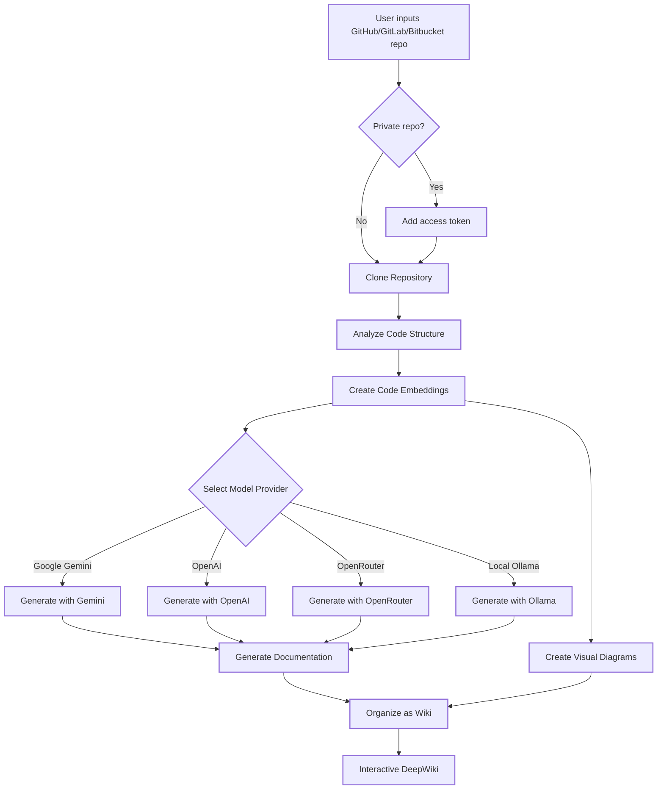
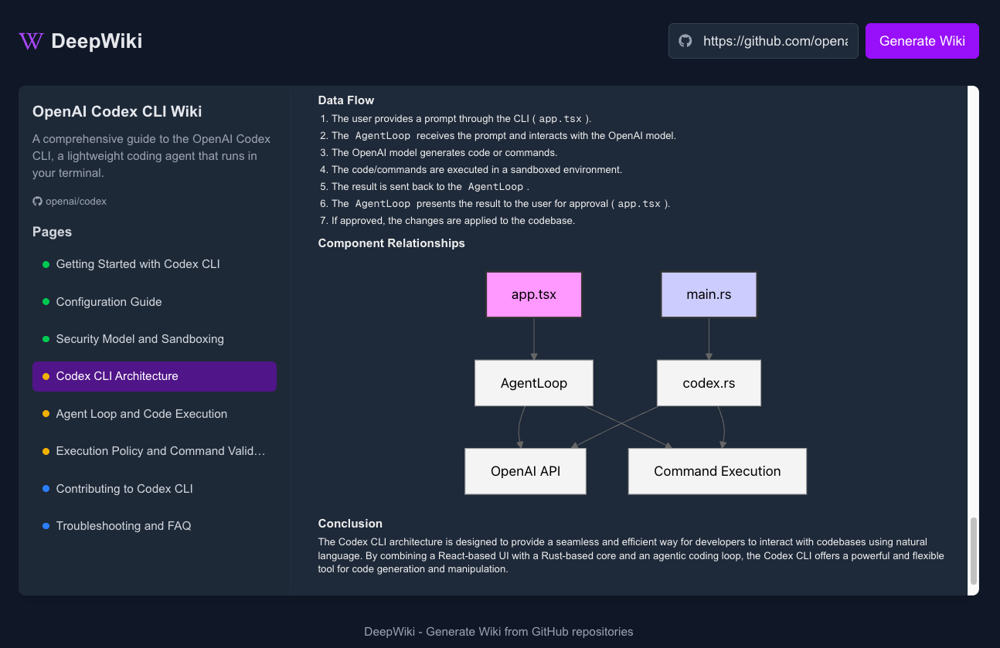
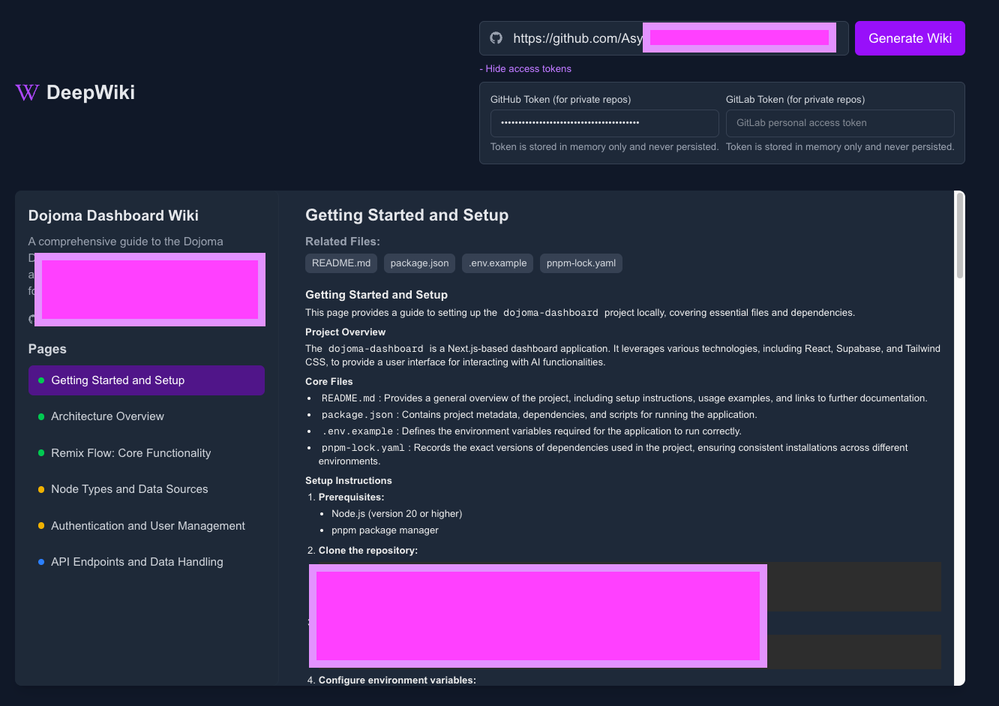
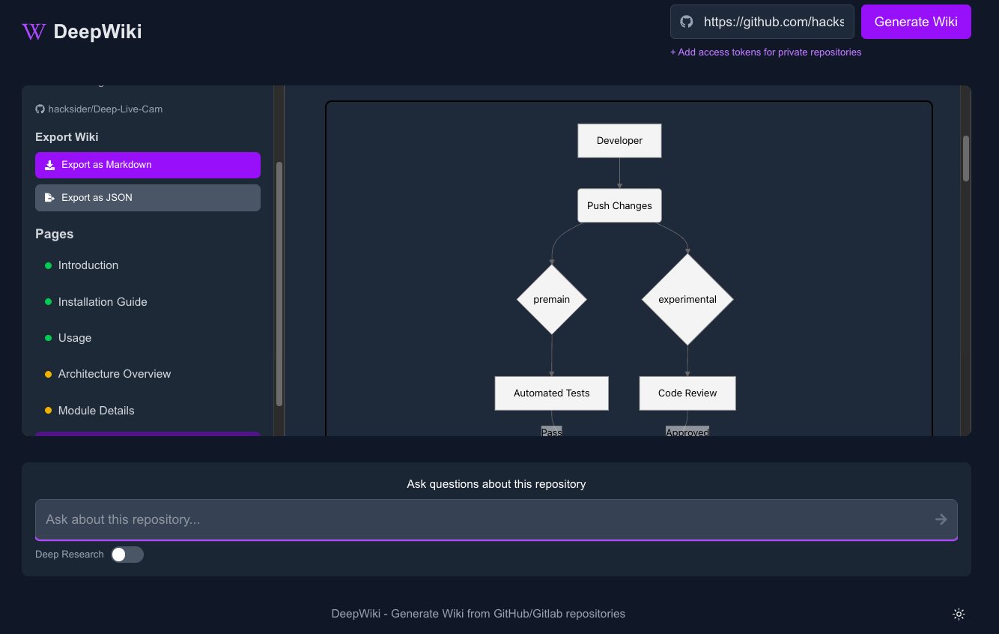

# DeepWiki-Open


**Open DeepWiki** là 1 triển khai thay thế cho DeepWiki, tự động tạo ra các trang wiki cho bất kỳ Repository  nào trên GitHub, GitLab hoặc BitBucket! Chỉ cần nhập đường dẫn Repository, và DeepWiki sẽ:

1. Phân tích cấu trúc mã nguồn
2. Tạo tài liệu đầy đủ và chi tiết
3. Tạo sơ đồ trực quan để giải thích cách mọi thứ hoạt động
4. Sắp xếp tất cả documents thành một wiki dễ hiểu

[](https://buymeacoffee.com/sheing)

[](https://x.com/sashimikun_void)
[](https://discord.com/invite/VQMBGR8u5v)

[English](./README.md) | [简体中文](./README.zh.md) | [日本語](./README.ja.md) | [Español](./README.es.md) | [한국어](./README.kr.md) | [Tiếng Việt](./README.vi.md) | [Português Brasileiro](./README.pt-br.md)

## ✨ Tính năng

- **Tạo Tài liệu tức thì**: Biến bất kỳ Repository GitHub, GitLab hoặc BitBucket nào thành wiki chỉ trong vài giây
- **Hỗ trợ Private Repository**: Truy cập Private Repository một cách an toàn với personal access tokens
- **Phân tích thông minh**: Hiểu cấu trúc và mối quan hệ của source codes nhờ AI
- **Tự động tạo Sơ đồ**: Tự động tạo sơ đồ Mermaid để trực quan hóa kiến trúc và luồng dữ liệu
- **Dễ dàng thao tác**:Giao diện wiki đơn giản, trực quan để khám phá
- **Trò chuyện với repository**: Trò chuyện với repo của bạn bằng AI (tích hợp RAG) để nhận câu trả lời chính xác
- **DeepResearch**:Quy trình Deep Research nhiều bước giúp phân tích kỹ lưỡng các chủ đề phức tạp
- **Hỗ trợ nhiều mô hình**: Hỗ trợ Google Gemini, OpenAI, OpenRouter, và  local Ollama models

## 🚀 Bắt đầu (Siêu dễ :))

### Option 1: Sử dụng Docker

```bash
# Clone repository
git clone https://github.com/AsyncFuncAI/deepwiki-open.git
cd deepwiki-open

# Tạo .env file với API keys
echo "GOOGLE_API_KEY=your_google_api_key" > .env
echo "OPENAI_API_KEY=your_openai_api_key" >> .env
# Optional: Thêm OpenRouter API key nếu bạn muốn OpenRouter models
echo "OPENROUTER_API_KEY=your_openrouter_api_key" >> .env

# Run với Docker Compose
docker-compose up
```

> 💡 **Hướng dẫn lấy Keys**
> - Lấy Google API key từ [Google AI Studio](https://makersuite.google.com/app/apikey)
> - Lấy OpenAI API key từ [OpenAI Platform](https://platform.openai.com/api-keys)

### Option 2: Setup thủ công (Khuyên dùng)

#### Bước 1: Set Up API Keys

Tạo  `.env` file trong thư mục gốc của project với những keys vừa tạo:

```
GOOGLE_API_KEY=your_google_api_key
OPENAI_API_KEY=your_openai_api_key
# Optional: Thêm OpenRouter API key nếu bạn muốn OpenRouter models
OPENROUTER_API_KEY=your_openrouter_api_key
```

#### Bước 2: Bắt đầu với Backend

```bash
# Cài đặt Python dependencies
pip install -r api/requirements.txt

# Chạy API server
python -m api.main
```

#### Bước 3: Bắt đầu với Frontend

```bash
# Cài đặt JavaScript dependencies
npm install
# Hoặc
yarn install

# Chạy the web app
npm run dev
# Hoặc
yarn dev
```

#### Bước 4: Dùng DeepWiki!

1. Mở [http://localhost:3000](http://localhost:3000) trên trình duyệt
2. Nhập đường dẫn GitHub, GitLab, hoặt Bitbucket repository (ví dụ như `https://github.com/openai/codex`, `https://github.com/microsoft/autogen`, `https://gitlab.com/gitlab-org/gitlab`, hay `https://bitbucket.org/redradish/atlassian_app_versions`)
3. Cho private repositories, Nhấn "+ Add access tokens" và nhập your GitHub hoặt GitLab personal access token
4. Click "Generate Wiki" và xem kết quả!

## 🔍 Cách Open Deepwiki hoạt động

DeepWiki dùng AI để:

1. Clone và phân tích GitHub, GitLab, hoặc Bitbucket repository (bao gồm private repos với token authentication)
2. Tạo embeddings cho code (Rag support)
3. Tạo documentation với context-aware AI (dùng Google Gemini, OpenAI, OpenRouter, hay local Ollama models)
4. Tạo diagrams để giải thích code relationships
5. Organize thông tin thành 1 trang wiki
6. Cho phép Q&A với repository
7. Cung cấp khả năng DeepResearch



## 🛠️ Cấu trúc dự án

```
deepwiki/
├── api/                  # Backend API server
│   ├── main.py           # API
│   ├── api.py            # FastAPI
│   ├── rag.py            # Retrieval Augmented Generation (RAG)
│   ├── data_pipeline.py  # Data processing utilities
│   └── requirements.txt  # Python dependencies
│
├── src/                  # Frontend Next.js app
│   ├── app/              # Next.js app directory
│   │   └── page.tsx      # Main application page
│   └── components/       # React components
│       └── Mermaid.tsx   # Mermaid diagram renderer
│
├── public/               # Static assets
├── package.json          # JavaScript dependencies
└── .env                  # Environment variables (create this)
```

## 🛠️ Cài đặt nâng cao

### Biến môi trường

| Biến môi trường | Mô tả | bắt buộc | ghi chú |
|----------|-------------|----------|------|
| `GOOGLE_API_KEY` | Google Gemini API key  | Có |
| `OPENAI_API_KEY` | OpenAI API key   | có |
| `OPENROUTER_API_KEY` | OpenRouter API key   | không| Yêu cầu nếu bạn muốn dùng OpenRouter models |
| `PORT` | Port của API server (mặc định: 8001) | không | Nếu bạn muốn chạy API và frontend trên cùng 1 máy, hãy điều chỉnh Port `SERVER_BASE_URL` |
| `SERVER_BASE_URL` | Đường dẫnn mặt định của API server (mặc định: http://localhost:8001) | không |

### Cài Đặt với Docker

Bạn có thể dùng Docker để run DeepWiki:

```bash
# Pull Docker image từ GitHub Container Registry
docker pull ghcr.io/asyncfuncai/deepwiki-open:latest

# Chạy container với biến môi trường
docker run -p 8001:8001 -p 3000:3000 \
  -e GOOGLE_API_KEY=your_google_api_key \
  -e OPENAI_API_KEY=your_openai_api_key \
  -e OPENROUTER_API_KEY=your_openrouter_api_key \
  -v ~/.adalflow:/root/.adalflow \
  ghcr.io/asyncfuncai/deepwiki-open:latest
```

Hoặc đơn giản hơn, sử dụng `docker-compose.yml` :

```bash
# Edit the .env file with your API keys first
docker-compose up
```

#### Sử dụng  .env file với Docker

Bạn có thể "mount"  .env file vào container:

```bash
# Tạo .env file với your API keys
echo "GOOGLE_API_KEY=your_google_api_key" > .env
echo "OPENAI_API_KEY=your_openai_api_key" >> .env
echo "OPENROUTER_API_KEY=your_openrouter_api_key" >> .env

# Run container với .env file
docker run -p 8001:8001 -p 3000:3000 \
  -v $(pwd)/.env:/app/.env \
  -v ~/.adalflow:/root/.adalflow \
  ghcr.io/asyncfuncai/deepwiki-open:latest
```

#### Bạn có thể Building the Docker image trên máy cục bộ


```bash
# Clone repository
git clone https://github.com/AsyncFuncAI/deepwiki-open.git
cd deepwiki-open

# Build Docker image
docker build -t deepwiki-open .

# Chạy container
docker run -p 8001:8001 -p 3000:3000 \
  -e GOOGLE_API_KEY=your_google_api_key \
  -e OPENAI_API_KEY=your_openai_api_key \
  -e OPENROUTER_API_KEY=your_openrouter_api_key \
  deepwiki-open
```

### Chi tiết API Server

API server cung cấp:
- Repository cloning và indexing
- RAG (Retrieval Augmented Generation)
- Trò chuyện liên tục

Biết thêm chi tiết truy cập [ API README](./api/README.md).

## 🤖 Hệ thống lựa chọn mô hình dựa trên nhà cung cấp

DeepWiki hiện đã triển khai một hệ thống lựa chọn mô hình linh hoạt dựa trên nhiều nhà cung cấp LLM:

### Các nhà cung cấp và mô hình được hỗ trợ

- **Google**: Mặc định là `gemini-2.0-flash`, cũng hỗ trợ `gemini-1.5-flash`, `gemini-1.0-pro`, v.v.
- **OpenAI**: Mặc định là `gpt-4o`, cũng hỗ trợ `o4-mini`, v.v.
- **OpenRouter**: Truy cập nhiều mô hình qua một API thống nhất, bao gồm Claude, Llama, Mistral, v.v.
- **Ollama**: Hỗ trợ các mô hình mã nguồn mở chạy cục bộ như `llama3`

### Biến môi trường

Mỗi nhà cung cấp yêu cầu các biến môi trường API key tương ứng:

```
# API Keys
GOOGLE_API_KEY=google_api_key_của_bạn        # Bắt buộc cho các mô hình Google Gemini
OPENAI_API_KEY=openai_key_của_bạn            # Bắt buộc cho các mô hình OpenAI
OPENROUTER_API_KEY=openrouter_key_của_bạn    # Bắt buộc cho các mô hình OpenRouter

# Cấu hình URL cơ sở cho OpenAI API
OPENAI_BASE_URL=https://endpoint-tùy-chỉnh.com/v1  # Tùy chọn, cho các điểm cuối API OpenAI tùy chỉnh

# Thư mục cấu hình
DEEPWIKI_CONFIG_DIR=/đường/dẫn/đến/thư_mục/cấu_hình  # Tùy chọn, cho vị trí tệp cấu hình tùy chỉnh
```

### Tệp cấu hình

DeepWiki sử dụng các tệp cấu hình JSON để quản lý các khía cạnh khác nhau của hệ thống:

1. **`generator.json`**: Cấu hình cho các mô hình tạo văn bản
   - Xác định các nhà cung cấp mô hình có sẵn (Google, OpenAI, OpenRouter, Ollama)
   - Chỉ định các mô hình mặc định và có sẵn cho mỗi nhà cung cấp
   - Chứa các tham số đặc thù cho mô hình như temperature và top_p

2. **`embedder.json`**: Cấu hình cho mô hình embedding và xử lý văn bản
   - Xác định mô hình embedding cho lưu trữ vector
   - Chứa cấu hình bộ truy xuất cho RAG
   - Chỉ định cài đặt trình chia văn bản để phân đoạn tài liệu

3. **`repo.json`**: Cấu hình xử lý repository
   - Chứa bộ lọc tệp để loại trừ một số tệp và thư mục nhất định
   - Xác định giới hạn kích thước repository và quy tắc xử lý

Mặc định, các tệp này nằm trong thư mục `api/config/`. Bạn có thể tùy chỉnh vị trí của chúng bằng biến môi trường `DEEPWIKI_CONFIG_DIR`.

### Lựa chọn mô hình tùy chỉnh cho nhà cung cấp dịch vụ

Tính năng lựa chọn mô hình tùy chỉnh được thiết kế đặc biệt cho các nhà cung cấp dịch vụ cần:

- Bạn có thể cung cấp cho người dùng trong tổ chức của mình nhiều lựa chọn mô hình AI khác nhau
- Bạn có thể thích ứng nhanh chóng với môi trường LLM đang phát triển nhanh chóng mà không cần thay đổi mã
- Bạn có thể hỗ trợ các mô hình chuyên biệt hoặc được tinh chỉnh không có trong danh sách định nghĩa trước

Bạn có thể triển khai các mô hình cung cấp bằng cách chọn từ các tùy chọn định nghĩa trước hoặc nhập định danh mô hình tùy chỉnh trong giao diện người dùng.

### Cấu hình URL cơ sở cho các kênh riêng doanh nghiệp

Cấu hình base_url của OpenAI Client được thiết kế chủ yếu cho người dùng doanh nghiệp có các kênh API riêng. Tính năng này:

- Cho phép kết nối với các điểm cuối API riêng hoặc dành riêng cho doanh nghiệp
- Cho phép các tổ chức sử dụng dịch vụ LLM tự lưu trữ hoặc triển khai tùy chỉnh
- Hỗ trợ tích hợp với các dịch vụ tương thích API OpenAI của bên thứ ba

**Sắp ra mắt**: Trong các bản cập nhật tương lai, DeepWiki sẽ hỗ trợ chế độ mà người dùng cần cung cấp API key của riêng họ trong các yêu cầu. Điều này sẽ cho phép khách hàng doanh nghiệp có kênh riêng sử dụng cấu hình API hiện có mà không cần chia sẻ thông tin đăng nhập với triển khai DeepWiki.

## 🔌 Tích hợp OpenRouter

DeepWiki hiện đã hỗ trợ [OpenRouter](https://openrouter.ai/) làm nhà cung cấp mô hình, cho phép bạn truy cập hàng trăm mô hình AI thông qua một API duy nhất:

- **Nhiều tùy chọn mô hình**: Truy cập các mô hình từ OpenAI, Anthropic, Google, Meta, Mistral và nhiều nhà cung cấp khác
- **Cấu hình đơn giản**: Chỉ cần thêm khóa API của bạn từ OpenRouter và chọn mô hình bạn muốn sử dụng
- **Tiết kiệm chi phí**: Lựa chọn mô hình phù hợp với ngân sách và nhu cầu hiệu suất của bạn
- **Chuyển đổi dễ dàng**: Chuyển đổi giữa các mô hình khác nhau mà không cần thay đổi mã nguồn


### Cách sử dụng OpenRouter với DeepWiki

1. **Lấy API Key**: Đăng ký tại [OpenRouter](https://openrouter.ai/) và lấy khóa API
2. **Thêm vào biến môi trường**: Thêm `OPENROUTER_API_KEY=your_key` vào file `.env`
3. **Bật trong giao diện**: Chọn "Use OpenRouter API" trên trang chủ
4. **Chọn mô hình**: Lựa chọn từ các mô hình phổ biến như GPT-4o, Claude 3.5 Sonnet, Gemini 2.0 và nhiều hơn nữa


OpenRouter đặc biệt hữu ích nếu bạn muốn:

- Thử nhiều mô hình khác nhau mà không cần đăng ký nhiều dịch vụ
- Truy cập các mô hình có thể bị giới hạn tại khu vực của bạn
- So sánh hiệu năng giữa các nhà cung cấp mô hình khác nhau
- Tối ưu hóa chi phí so với hiệu suất dựa trên nhu cầu của bạn


## 🤖 Tính năng Hỏi & Nghiên cứu Sâu (DeepResearch)

### Tính năng Hỏi (Ask)

Tính năng Hỏi cho phép bạn trò chuyện với kho mã của mình bằng cách sử dụng kỹ thuật RAG (Retrieval Augmented Generation):

- **Phản hồi theo ngữ cảnh**: Nhận câu trả lời chính xác dựa trên mã thực tế trong kho của bạn
- **Ứng dụng RAG**: Hệ thống truy xuất các đoạn mã liên quan để tạo ra câu trả lời có cơ sở
- **Phản hồi theo thởi gian thực**: Xem câu trả lời được tạo ra trực tiếp, mang lại trải nghiệm tương tác hơn
- **Lưu lịch sử cuộc trò chuyện**: Hệ thống duy trì ngữ cảnh giữa các câu hỏi để cuộc đối thoại liền mạch hơn


### Tính năng DeepResearch

DeepResearch nâng tầm phân tích kho mã với quy trình nghiện cứu nhiểu vòng:

- **Ngieen cứu chuyên sâu**: Khám phá kỹ lưỡng các chủ đề phức tạp thông qua nhiểu vòng nghiện cứu
- **Quy trình có cấu trúc**: Tuân theo kế hoạch nghiện cứu rõ ràng với các bản cập nhật và kết luận tổng thể
- **Tự động tiếp tục**: AI sẽ tự động tiếp tục quá trình nghiện cứu cho đến khi đưa ra kết luận (tối đa 5 vòng)
- **Các giai đoạn nghiện cứu**:
  1. **Kế hoạch nghiện cứu**: Phác thảo phương pháp và những phát hiện ban đầu
  2. **Cập nhật nghiện cứu**: Bổ sung kiến thức mới qua từng vòng lặp
  3. **Kết luận cuối cùng**: Đưa ra câu trả lời toàn diện dựa trên tất cả các vòng nghiện cứu

Để sử dụng DeepResearch, chỉ cần bật công tắc "Deep Research" trong giao diện Hỏi (Ask) trước khi gửi câu hỏi của bạn.


## 📱 Ảnh chụp màng hình


*Giao diện chính của DeepWiki*


*Truy cập kho riêng tư bằng Personal Access Token*


*DeepResearch thực hiện nghiện cứu nhiểu vòng cho các chủ đề phức tạp*

### Demo Video

[](https://youtu.be/zGANs8US8B4)


## ❓ Khắc phục sự cố

### Vấn đề với API Key
- **"Thiếu biến môi trường"**: Đảm bảo rằng file `.env` của bạn nằm ở thư mục gốc của dự án và chứa các API key cần thiết
- **"API key không hợp lệ"**: Kiểm tra lại xem bạn đã sao chép đầy đủ API key mà không có khoảng trắng thừa chưa
- **"Lỗi API OpenRouter"**: Xác minh rằng API key của OpenRouter là hợp lệ và có đủ tín dụng

### Vấn đề kết nối
- **"Không thể kết nối với máy chủ API"**: Đảm bảo máy chủ API đang chạy trên cổng 8001
- **"Lỗi CORS"**: API được cấu hình để cho phép tất cả các nguồn gốc, nhưng nếu gặp sự cố, thử chạy cả frontend và backend trên cùng một máy tính

### Vấn đề khi tạo nội dung
- **"Lỗi khi tạo wiki"**: Với các kho mã rất lớn, hãy thử trước với kho mã nhỏ hơn
- **"Định dạng kho mã không hợp lệ"**: Đảm bảo bạn đang sử dụng định dạng URL hợp lệ cho GitHub, GitLab hoặc Bitbucket
- **"Không thể lấy cấu trúc kho mã"**: Với các kho mã riêng tư, hãy đảm bảo bạn đã nhập token truy cập cá nhân hợp lệ và có quyền truy cập phù hợp
- **"Lỗi khi render sơ đồ"**: Ứng dụng sẽ tự động thử khắc phục các sơ đồ bị lỗi

### Các giải pháp phổ biến
1. **Khởi động lại cả hai máy chủ**: Đôi khi, một lần khởi động lại đơn giản có thể giải quyết hầu hết các vấn đề
2. **Kiểm tra nhật ký trình duyệt**: Mở công cụ phát triển của trình duyệt để xem các lỗi JavaScript
3. **Kiểm tra nhật ký API**: Xem các lỗi Python trong terminal nơi API đang chạy


## 🤝 Đóng góp

Chúng tôi hoan nghênh mọi đóng góp! Bạn có thể:
- Mở các vấn đề (issues) để báo lỗi hoặc yêu cầu tính năng
- Gửi pull request để cải thiện mã nguồn
- Chia sẻ phản hồi và ý tưởng của bạn

## 📄 Giấy phép

Dự án này được cấp phép theo Giấy phép MIT - xem file [LICENSE](LICENSE) để biết chi tiết.

## ⭐ Lịch sử

[](https://star-history.com/#AsyncFuncAI/deepwiki-open&Date)

