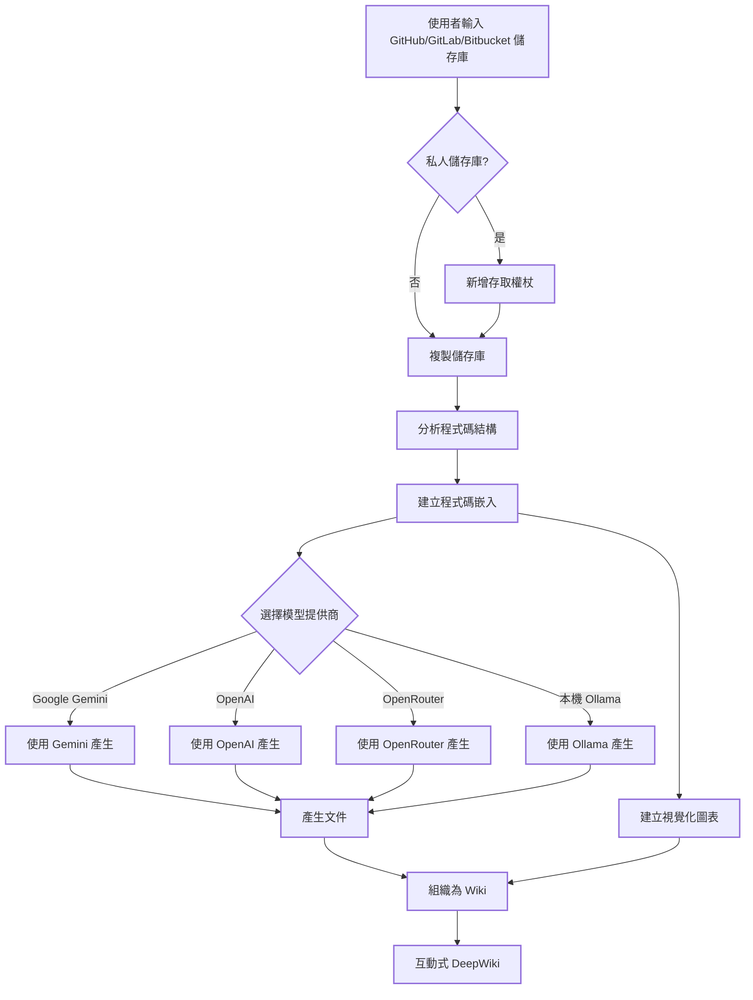

# DeepWiki-Open


**DeepWiki** 可以為任何 GitHub、GitLab 或 BitBucket 程式碼儲存庫自動建立美觀、互動式的 Wiki！只需輸入儲存庫名稱，DeepWiki 將：

1. 分析程式碼結構
2. 產生全面的文件
3. 建立視覺化圖表解釋一切如何運作
4. 將所有內容整理成易於導覽的 Wiki

[](https://buymeacoffee.com/sheing)
[](https://tip.md/sng-asyncfunc)
[](https://x.com/sashimikun_void)
[](https://discord.com/invite/VQMBGR8u5v)

[English](./README.md) | [简体中文](./README.zh.md) | [繁體中文](./README.zh-tw.md) | [日本語](./README.ja.md) | [Español](./README.es.md) | [한국어](./README.kr.md) | [Tiếng Việt](./README.vi.md)

## ✨ 特點

- **即時文件**：幾秒鐘內將任何 GitHub、GitLab 或 BitBucket 儲存庫轉換為 Wiki
- **私人儲存庫支援**：使用個人存取權杖安全存取私人儲存庫
- **智慧分析**：AI 驅動的程式碼結構和關係理解
- **精美圖表**：自動產生 Mermaid 圖表視覺化架構和資料流
- **簡易導覽**：簡單、直觀的介面探索 Wiki
- **提問功能**：使用 RAG 驅動的 AI 與您的儲存庫聊天，取得準確答案
- **深度研究**：多輪研究過程，徹底調查複雜主題
- **多模型提供商**：支援 Google Gemini、OpenAI、OpenRouter 和本機 Ollama 模型

## 🚀 快速開始（超級簡單！）

### 選項 1：使用 Docker

```bash
# 複製儲存庫
git clone https://github.com/AsyncFuncAI/deepwiki-open.git
cd deepwiki-open

# 建立包含 API 金鑰的 .env 檔案
echo "GOOGLE_API_KEY=your_google_api_key" > .env
echo "OPENAI_API_KEY=your_openai_api_key" >> .env
# 可選：如果您想使用 OpenRouter 模型，新增 OpenRouter API 金鑰
echo "OPENROUTER_API_KEY=your_openrouter_api_key" >> .env
# 可選：如果 Ollama 不在本機執行，新增 Ollama 主機位址，預設為 http://localhost:11434
echo "OLLAMA_HOST=your_ollama_host" >> .env

# 使用 Docker Compose 執行
docker-compose up
```

有關使用 DeepWiki 搭配 Ollama 和 Docker 的詳細說明，請參閱 [Ollama 操作說明](Ollama-instruction.md)。

(上述 Docker 命令以及 `docker-compose.yml` 設定會掛載您主機上的 `~/.adalflow` 目錄到容器內的 `/root/.adalflow`。此路徑用於儲存：
- 複製的儲存庫 (`~/.adalflow/repos/`)
- 儲存庫的嵌入和索引 (`~/.adalflow/databases/`)
- 快取的已產生 Wiki 內容 (`~/.adalflow/wikicache/`)

這確保了即使容器停止或移除，您的資料也能持久保存。)

> 💡 **取得這些金鑰的地方：**
> - 從 [Google AI Studio](https://makersuite.google.com/app/apikey) 取得 Google API 金鑰
> - 從 [OpenAI Platform](https://platform.openai.com/api-keys) 取得 OpenAI API 金鑰

### 選項 2：手動設定（推薦）

#### 步驟 1：設定 API 金鑰

在專案根目錄建立一個 `.env` 檔案，包含以下金鑰：

```
GOOGLE_API_KEY=your_google_api_key
OPENAI_API_KEY=your_openai_api_key
# 可選：如果您想使用 OpenRouter 模型，新增此項
OPENROUTER_API_KEY=your_openrouter_api_key
# 可選：如果 Ollama 不在本機執行，新增 Ollama 主機位址，預設為 http://localhost:11434
OLLAMA_HOST=your_ollama_host
```

#### 步驟 2：啟動後端

```bash
# 安裝 Python 相依性
pip install -r api/requirements.txt

# 啟動 API 伺服器
python -m api.main
```

#### 步驟 3：啟動前端

```bash
# 安裝 JavaScript 相依性
npm install
# 或
yarn install

# 啟動 Web 應用
npm run dev
# 或
yarn dev
```

#### 步驟 4：使用 DeepWiki！

1. 在瀏覽器中開啟 [http://localhost:3000](http://localhost:3000)
2. 輸入 GitHub、GitLab 或 Bitbucket 儲存庫（如 `https://github.com/openai/codex`、`https://github.com/microsoft/autogen`、`https://gitlab.com/gitlab-org/gitlab` 或 `https://bitbucket.org/redradish/atlassian_app_versions`）
3. 對於私人儲存庫，點擊「+ 新增存取權杖」並輸入您的 GitHub 或 GitLab 個人存取權杖
4. 點擊「產生 Wiki」，見證奇蹟的發生！

## 🔍 工作原理

DeepWiki 使用 AI 來：

1. 複製並分析 GitHub、GitLab 或 Bitbucket 儲存庫（包括使用權杖驗證的私人儲存庫）
2. 建立程式碼嵌入用於智慧檢索
3. 使用上下文感知 AI 產生文件（使用 Google Gemini、OpenAI、OpenRouter 或本機 Ollama 模型）
4. 建立視覺化圖表解釋程式碼關係
5. 將所有內容組織成結構化 Wiki
6. 透過提問功能實現與儲存庫的智慧問答
7. 透過深度研究功能提供深入研究能力



## 🛠️ 專案結構

```
deepwiki/
├── api/                  # 後端 API 伺服器
│   ├── main.py           # API 進入點
│   ├── api.py            # FastAPI 實作
│   ├── rag.py            # 檢索增強產生
│   ├── data_pipeline.py  # 資料處理工具
│   └── requirements.txt  # Python 相依性
│
├── src/                  # 前端 Next.js 應用
│   ├── app/              # Next.js 應用目錄
│   │   └── page.tsx      # 主應用頁面
│   └── components/       # React 元件
│       └── Mermaid.tsx   # Mermaid 圖表渲染器
│
├── public/               # 靜態資源
├── package.json          # JavaScript 相依性
└── .env                  # 環境變數（需要建立）
```

## 🤖 基於提供商的模型選擇系統

DeepWiki 現在實作了靈活的基於提供商的模型選擇系統，支援多種 LLM 提供商：

### 支援的提供商和模型

- **Google**：預設 `gemini-2.0-flash`，也支援 `gemini-1.5-flash`、`gemini-1.0-pro` 等
- **OpenAI**：預設 `gpt-4o`，也支援 `o4-mini` 等
- **OpenRouter**：透過統一 API 存取多種模型，包括 Claude、Llama、Mistral 等
- **Ollama**：支援本機執行的開源模型，如 `llama3`

### 環境變數

每個提供商都需要對應的 API 金鑰環境變數：

```
# API 金鑰
GOOGLE_API_KEY=your_google_api_key        # 使用 Google Gemini 模型時必需
OPENAI_API_KEY=your_openai_api_key        # 使用 OpenAI 模型時必需
OPENROUTER_API_KEY=your_openrouter_api_key # 使用 OpenRouter 模型時必需

# OpenAI API 基礎 URL 設定
OPENAI_BASE_URL=https://custom-api-endpoint.com/v1  # 可選，用於自訂 OpenAI API 端點

# Ollama 主機
OLLAMA_HOST=your_ollama_host # 可選，如果 Ollama 不在本機執行，預設為 http://localhost:11434

# 設定檔目錄
DEEPWIKI_CONFIG_DIR=/path/to/custom/config/dir  # 可選，用於自訂設定檔位置
```

### 設定檔

DeepWiki 使用 JSON 設定檔來管理系統的各個層面：

1. **`generator.json`**：文字產生模型設定
   - 定義可用的模型提供商（Google、OpenAI、OpenRouter、Ollama）
   - 指定每個提供商的預設和可用模型
   - 包含模型特定參數，如 temperature 和 top_p

2. **`embedder.json`**：嵌入模型和文字處理設定
   - 定義用於向量儲存的嵌入模型
   - 包含用於 RAG 的檢索器設定
   - 指定文件分塊的文字分割器設定

3. **`repo.json`**：儲存庫處理設定
   - 包含排除特定檔案和目錄的檔案篩選器
   - 定義儲存庫大小限制和處理規則

預設情況下，這些檔案位於 `api/config/` 目錄中。您可以使用 `DEEPWIKI_CONFIG_DIR` 環境變數自訂它們的位置。

### 為服務提供商設計的自訂模型選擇

自訂模型選擇功能專為需要以下功能的服務提供商設計：

- 您可以在組織內為使用者提供多種 AI 模型選擇
- 您可以快速適應快速發展的 LLM 領域，無需變更程式碼
- 您可以支援不在預定義清單中的專業或微調模型

服務提供商可以透過從預定義選項中選擇或在前端介面中輸入自訂模型識別符來實作其模型提供方案。

### 為企業私有通道設計的基礎 URL 設定

OpenAI 客戶端的 base_url 設定主要為擁有私有 API 通道的企業使用者設計。此功能：

- 支援連線到私有或企業特定的 API 端點
- 允許組織使用自己的自主託管或自訂部署的 LLM 服務
- 支援與第三方 OpenAI API 相容服務的整合

**即將推出**：在未來的更新中，DeepWiki 將支援一種模式，讓使用者需要在請求中提供自己的 API 金鑰。這將允許擁有私有通道的企業客戶使用其現有的 API 安排，而不必與 DeepWiki 部署共享憑證。

## 🧩 使用 OpenAI 相容的嵌入模型（如阿里巴巴 Qwen）

如果您想使用與 OpenAI API 相容的嵌入模型（如阿里巴巴 Qwen），請按照以下步驟操作：

1. 用 `api/config/embedder_openai_compatible.json` 的內容替換 `api/config/embedder.json` 的內容。
2. 在專案根目錄的 `.env` 檔案中，設定相關的環境變數，例如：
   ```
   OPENAI_API_KEY=your_api_key
   OPENAI_API_BASE_URL=your_openai_compatible_endpoint
   ```
3. 程式會自動用環境變數的值替換 embedder.json 中的預留位置。

這讓您可以無縫切換到任何 OpenAI 相容的嵌入服務，無需變更程式碼。

### 日誌記錄

DeepWiki 使用 Python 的內建 `logging` 模組進行診斷輸出。您可以透過環境變數設定詳細程度和日誌檔案目標：

| 變數             | 說明                                                                 | 預設值                        |
|-----------------|----------------------------------------------------------------------|------------------------------|
| `LOG_LEVEL`     | 日誌記錄等級（DEBUG、INFO、WARNING、ERROR、CRITICAL）                    | INFO                         |
| `LOG_FILE_PATH` | 日誌檔案的路徑。如果設定，日誌將寫入此檔案   | `api/logs/application.log`   |

要啟用除錯日誌並將日誌導向自訂檔案：
```bash
export LOG_LEVEL=DEBUG
export LOG_FILE_PATH=./debug.log
python -m api.main
```
或使用 Docker Compose：
```bash
LOG_LEVEL=DEBUG LOG_FILE_PATH=./debug.log docker-compose up
```

使用 Docker Compose 執行時，容器的 `api/logs` 目錄會掛載到主機上的 `./api/logs`（請參閱 `docker-compose.yml` 中的 `volumes` 區段），確保日誌檔案在重新啟動後仍然存在。

您也可以將這些設定儲存在 `.env` 檔案中：

```bash
LOG_LEVEL=DEBUG
LOG_FILE_PATH=./debug.log
```
然後簡單執行：

```bash
docker-compose up
```

**日誌路徑安全性考量：** 在生產環境中，請確保 `api/logs` 目錄和任何自訂日誌檔案路徑都受到適當的檔案系統權限和存取控制保護。應用程式會強制要求 `LOG_FILE_PATH` 位於專案的 `api/logs` 目錄內，以防止路徑遍歷或未授權的寫入。

## 🛠️ 進階設定

### 環境變數

| 變數             | 說明                                                  | 必需 | 備註                                                                                                     |
|----------------------|--------------------------------------------------------------|----------|----------------------------------------------------------------------------------------------------------|
| `GOOGLE_API_KEY`     | Google Gemini API 金鑰，用於 AI 產生                      | 否 | 只有在您想使用 Google Gemini 模型時才需要                                                    
| `OPENAI_API_KEY`     | OpenAI API 金鑰，用於嵌入                                | 是 | 備註：即使您不使用 OpenAI 模型，這個也是必需的，因為它用於嵌入              |
| `OPENROUTER_API_KEY` | OpenRouter API 金鑰，用於替代模型                    | 否 | 只有在您想使用 OpenRouter 模型時才需要                                                       |
| `OLLAMA_HOST`        | Ollama 主機（預設：http://localhost:11434）                | 否 | 只有在您想使用外部 Ollama 伺服器時才需要                                                  |
| `PORT`               | API 伺服器的連接埠（預設：8001）                      | 否 | 如果您在同一台機器上託管 API 和前端，請確保相應地變更 `SERVER_BASE_URL` 的連接埠 |
| `SERVER_BASE_URL`    | API 伺服器的基礎 URL（預設：http://localhost:8001） | 否 |
| `DEEPWIKI_AUTH_MODE` | 設定為 `true` 或 `1` 以啟用授權模式 | 否 | 預設為 `false`。如果啟用，則需要 `DEEPWIKI_AUTH_CODE` |
| `DEEPWIKI_AUTH_CODE` | 當 `DEEPWIKI_AUTH_MODE` 啟用時，Wiki 產生所需的秘密代碼 | 否 | 只有在 `DEEPWIKI_AUTH_MODE` 為 `true` 或 `1` 時才使用 |

如果您不使用 ollama 模式，您需要設定 OpenAI API 金鑰用於嵌入。其他 API 金鑰只有在設定並使用對應提供商的模型時才需要。

## 授權模式

DeepWiki 可以設定為在授權模式下執行，在此模式下，Wiki 產生需要有效的授權代碼。如果您想控制誰可以使用產生功能，這會很有用。
限制前端啟動並保護快取刪除，但如果直接存取 API 端點，無法完全防止後端產生。

要啟用授權模式，請設定以下環境變數：

- `DEEPWIKI_AUTH_MODE`：將此設定為 `true` 或 `1`。啟用時，前端將顯示授權代碼的輸入欄位。
- `DEEPWIKI_AUTH_CODE`：將此設定為所需的秘密代碼。限制前端啟動並保護快取刪除，但如果直接存取 API 端點，無法完全防止後端產生。

如果未設定 `DEEPWIKI_AUTH_MODE` 或設定為 `false`（或除 `true`/`1` 以外的任何其他值），授權功能將被停用，不需要任何代碼。

### Docker 設定

您可以使用 Docker 來執行 DeepWiki：

```bash
# 從 GitHub Container Registry 拉取映像
docker pull ghcr.io/asyncfuncai/deepwiki-open:latest

# 使用環境變數執行容器
docker run -p 8001:8001 -p 3000:3000 \
  -e GOOGLE_API_KEY=your_google_api_key \
  -e OPENAI_API_KEY=your_openai_api_key \
  -e OPENROUTER_API_KEY=your_openrouter_api_key \
  -e OLLAMA_HOST=your_ollama_host \
  -v ~/.adalflow:/root/.adalflow \
  ghcr.io/asyncfuncai/deepwiki-open:latest
```

此命令也會將主機上的 `~/.adalflow` 掛載到容器中的 `/root/.adalflow`。此路徑用於儲存：
- 複製的儲存庫（`~/.adalflow/repos/`）
- 它們的嵌入和索引（`~/.adalflow/databases/`）
- 快取的已產生 Wiki 內容（`~/.adalflow/wikicache/`）

這確保即使容器停止或移除，您的資料也會持續存在。

或使用提供的 `docker-compose.yml` 檔案：

```bash
# 首先使用您的 API 金鑰編輯 .env 檔案
docker-compose up
```

（`docker-compose.yml` 檔案預先設定為掛載 `~/.adalflow` 以保持資料持續性，類似於上面的 `docker run` 命令。）

#### 在 Docker 中使用 .env 檔案

您也可以將 .env 檔案掛載到容器：

```bash
# 使用您的 API 金鑰建立 .env 檔案
echo "GOOGLE_API_KEY=your_google_api_key" > .env
echo "OPENAI_API_KEY=your_openai_api_key" >> .env
echo "OPENROUTER_API_KEY=your_openrouter_api_key" >> .env
echo "OLLAMA_HOST=your_ollama_host" >> .env

# 使用掛載的 .env 檔案執行容器
docker run -p 8001:8001 -p 3000:3000 \
  -v $(pwd)/.env:/app/.env \
  -v ~/.adalflow:/root/.adalflow \
  ghcr.io/asyncfuncai/deepwiki-open:latest
```

此命令也會將主機上的 `~/.adalflow` 掛載到容器中的 `/root/.adalflow`。此路徑用於儲存：
- 複製的儲存庫（`~/.adalflow/repos/`）
- 它們的嵌入和索引（`~/.adalflow/databases/`）
- 快取的已產生 Wiki 內容（`~/.adalflow/wikicache/`）

這確保即使容器停止或移除，您的資料也會持續存在。

#### 在本機建置 Docker 映像

如果您想在本機建置 Docker 映像：

```bash
# 複製儲存庫
git clone https://github.com/AsyncFuncAI/deepwiki-open.git
cd deepwiki-open

# 建置 Docker 映像
docker build -t deepwiki-open .

# 執行容器
docker run -p 8001:8001 -p 3000:3000 \
  -e GOOGLE_API_KEY=your_google_api_key \
  -e OPENAI_API_KEY=your_openai_api_key \
  -e OPENROUTER_API_KEY=your_openrouter_api_key \
  -e OLLAMA_HOST=your_ollama_host \
  deepwiki-open
```

### API 伺服器詳細資訊

API 伺服器提供：
- 儲存庫複製和索引
- RAG（檢索增強產生）
- 串流聊天完成

更多詳細資訊，請參閱 [API README](./api/README.md)。

## 🔌 OpenRouter 整合

DeepWiki 現在支援 [OpenRouter](https://openrouter.ai/) 作為模型提供商，讓您可以透過單一 API 存取數百個 AI 模型：

- **多種模型選項**：存取來自 OpenAI、Anthropic、Google、Meta、Mistral 等的模型
- **簡單設定**：只需新增您的 OpenRouter API 金鑰並選擇您想使用的模型
- **成本效益**：選擇符合您預算和效能需求的模型
- **輕鬆切換**：在不同模型之間切換，無需變更程式碼

### 如何在 DeepWiki 中使用 OpenRouter

1. **取得 API 金鑰**：在 [OpenRouter](https://openrouter.ai/) 註冊並取得您的 API 金鑰
2. **新增到環境**：在您的 `.env` 檔案中新增 `OPENROUTER_API_KEY=your_key`
3. **在 UI 中啟用**：在首頁勾選「使用 OpenRouter API」選項
4. **選擇模型**：從熱門模型中選擇，如 GPT-4o、Claude 3.5 Sonnet、Gemini 2.0 等

OpenRouter 特別適用於以下情況：
- 想嘗試不同模型而不用註冊多個服務
- 存取在您所在地區可能受限的模型
- 比較不同模型提供商的效能
- 根據您的需求最佳化成本與效能的平衡

## 🤖 提問和深度研究功能

### 提問功能

提問功能允許您使用檢索增強產生（RAG）與您的儲存庫聊天：

- **上下文感知回應**：基於儲存庫中實際程式碼取得準確答案
- **RAG 驅動**：系統檢索相關程式碼片段，提供有根據的回應
- **即時串流傳輸**：即時檢視產生的回應，取得更互動式的體驗
- **對話歷史**：系統在問題之間保持上下文，實現更連貫的互動

### 深度研究功能

深度研究透過多輪研究過程將儲存庫分析提升到新水平：

- **深入調查**：透過多次研究迭代徹底探索複雜主題
- **結構化過程**：遵循清晰的研究計畫，包含更新和全面結論
- **自動繼續**：AI 自動繼續研究直到達成結論（最多 5 次迭代）
- **研究階段**：
  1. **研究計畫**：概述方法和初步發現
  2. **研究更新**：在前一輪迭代基礎上增加新見解
  3. **最終結論**：基於所有迭代提供全面答案

要使用深度研究，只需在提交問題前在提問介面中切換「深度研究」開關。

## 📱 螢幕截圖

### 主頁面


### Wiki 頁面


### 提問功能


### 深度研究


### 展示影片

[](https://youtu.be/zGANs8US8B4)

*觀看 DeepWiki 實際操作！*

## 🔧 配置選項

### 模型提供商

DeepWiki 支援多個 AI 模型提供商：

1. **Google Gemini**（預設）
   - 快速且經濟實惠
   - 良好的程式碼理解能力

2. **OpenAI**
   - 高品質輸出
   - 支援 GPT-4 和 GPT-3.5

3. **OpenRouter**
   - 存取多個模型
   - 靈活的定價選項

4. **本機 Ollama**
   - 隱私保護
   - 離線執行
   - 需要本機設定

### Wiki 類型

- **全面型**：包含詳細分析、程式碼範例和完整文件
- **簡潔型**：專注於核心功能和關鍵見解

## 🌍 支援的平台

- **GitHub**：公開和私人儲存庫
- **GitLab**：GitLab.com 和自主託管實例
- **Bitbucket**：Atlassian 託管的儲存庫

## 📚 API 端點

### `/api/wiki_cache`
- **方法**：GET
- **描述**：檢索快取的 Wiki 資料
- **參數**：
  - `repo`: 儲存庫識別符
  - `platform`: git 平台（github、gitlab、bitbucket）

### `/export/wiki`
- **方法**：GET
- **描述**：匯出 Wiki 為 Markdown 或 JSON
- **參數**：
  - `repo`: 儲存庫識別符
  - `format`: 匯出格式（markdown、json）

## ❓ 故障排除

### API 金鑰問題
- **「缺少環境變數」**：確保您的 `.env` 檔案位於專案根目錄並包含所需的 API 金鑰
- **「API 金鑰無效」**：檢查您是否正確複製了完整金鑰，沒有多餘空格
- **「OpenRouter API 錯誤」**：驗證您的 OpenRouter API 金鑰有效且有足夠的額度

### 連線問題
- **「無法連線到 API 伺服器」**：確保 API 伺服器在連接埠 8001 上執行
- **「CORS 錯誤」**：API 設定為允許所有來源，但如果您遇到問題，請嘗試在同一台機器上執行前端和後端

### 產生問題
- **「產生 Wiki 時出錯」**：對於非常大的儲存庫，請先嘗試較小的儲存庫
- **「無效的儲存庫格式」**：確保您使用有效的 GitHub、GitLab 或 Bitbucket URL 格式
- **「無法擷取儲存庫結構」**：對於私人儲存庫，確保您輸入了具有適當權限的有效個人存取權杖
- **「圖表轉譯錯誤」**：應用程式將自動嘗試修復損壞的圖表

### 常見解決方案
1. **重新啟動兩個伺服器**：有時簡單的重新啟動可以解決大多數問題
2. **檢查主控台日誌**：開啟瀏覽器開發者工具查看任何 JavaScript 錯誤
3. **檢查 API 日誌**：查看執行 API 的終端中的 Python 錯誤

## 🤝 貢獻

我們歡迎各種形式的貢獻！無論是錯誤報告、功能請求還是程式碼貢獻。

### 開發設定

1. Fork 此儲存庫
2. 建立功能分支：`git checkout -b feature/amazing-feature`
3. 提交您的變更：`git commit -m 'Add amazing feature'`
4. 推送到分支：`git push origin feature/amazing-feature`
5. 開啟 Pull Request

### 新增新語言支援

1. 在 `src/messages/` 中新增新的翻譯檔案
2. 更新 `src/i18n.ts` 中的 `locales` 陣列
3. 建立相對應的 README 檔案
4. 測試翻譯

## 📄 授權

此專案根據 MIT 授權條款授權 - 詳情請參閱 [LICENSE](LICENSE) 檔案。

## 🙏 致謝

- 感謝所有貢獻者的努力
- 基於 Next.js、FastAPI 和各種開源程式庫建構
- 特別感謝 AI 模型提供商讓此專案成為可能

## 🐛 問題回報

如果您遇到任何問題，請在 GitHub Issues 中建立問題報告。請包含：

- 錯誤描述
- 重現步驟
- 預期行為
- 螢幕截圖（如果適用）
- 系統資訊

## 🔮 未來計劃

- [ ] 更多 AI 模型整合
- [ ] 進階程式碼分析功能
- [ ] 即時協作編輯
- [ ] 行動應用支援
- [ ] 企業級功能

## ⭐ Star 歷史

[](https://star-history.com/#AsyncFuncAI/deepwiki-open&Date)
