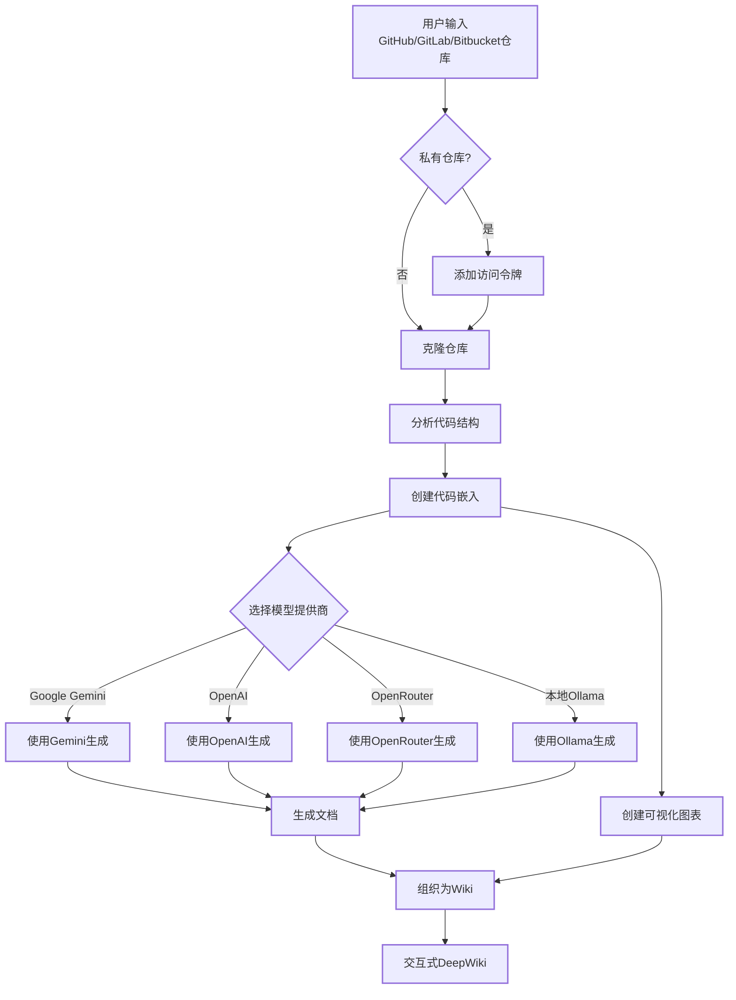

# DeepWiki-Open


**DeepWiki**可以为任何GitHub、GitLab或BitBucket代码仓库自动创建美观、交互式的Wiki！只需输入仓库名称，DeepWiki将：

1. 分析代码结构
2. 生成全面的文档
3. 创建可视化图表解释一切如何运作
4. 将所有内容整理成易于导航的Wiki

[](https://buymeacoffee.com/sheing)

[](https://x.com/sashimikun_void)
[](https://discord.com/invite/VQMBGR8u5v)

## ✨ 特点

- **即时文档**：几秒钟内将任何GitHub、GitLab或BitBucket仓库转换为Wiki
- **私有仓库支持**：使用个人访问令牌安全访问私有仓库
- **智能分析**：AI驱动的代码结构和关系理解
- **精美图表**：自动生成Mermaid图表可视化架构和数据流
- **简易导航**：简单、直观的界面探索Wiki
- **提问功能**：使用RAG驱动的AI与您的仓库聊天，获取准确答案
- **深度研究**：多轮研究过程，彻底调查复杂主题
- **多模型提供商**：支持Google Gemini、OpenAI、OpenRouter和本地Ollama模型

## 🚀 快速开始（超级简单！）

### 选项1：使用Docker

```bash
# 克隆仓库
git clone https://github.com/AsyncFuncAI/deepwiki-open.git
cd deepwiki-open

# 创建包含API密钥的.env文件
echo "GOOGLE_API_KEY=your_google_api_key" > .env
echo "OPENAI_API_KEY=your_openai_api_key" >> .env
# 可选：如果您想使用OpenRouter模型，添加OpenRouter API密钥
echo "OPENROUTER_API_KEY=your_openrouter_api_key" >> .env

# 使用Docker Compose运行
docker-compose up
```

(上述 Docker 命令以及 `docker-compose.yml` 配置会挂载您主机上的 `~/.adalflow` 目录到容器内的 `/root/.adalflow`。此路径用于存储：
- 克隆的仓库 (`~/.adalflow/repos/`)
- 仓库的嵌入和索引 (`~/.adalflow/databases/`)
- 缓存的已生成 Wiki 内容 (`~/.adalflow/wikicache/`)

这确保了即使容器停止或移除，您的数据也能持久保存。)

> 💡 **获取这些密钥的地方：**
> - 从[Google AI Studio](https://makersuite.google.com/app/apikey)获取Google API密钥
> - 从[OpenAI Platform](https://platform.openai.com/api-keys)获取OpenAI API密钥

### 选项2：手动设置（推荐）

#### 步骤1：设置API密钥

在项目根目录创建一个`.env`文件，包含以下密钥：

```
GOOGLE_API_KEY=your_google_api_key
OPENAI_API_KEY=your_openai_api_key
# 可选：如果您想使用OpenRouter模型，添加此项
OPENROUTER_API_KEY=your_openrouter_api_key
```

#### 步骤2：启动后端

```bash
# 安装Python依赖
pip install -r api/requirements.txt

# 启动API服务器
python -m api.main
```

#### 步骤3：启动前端

```bash
# 安装JavaScript依赖
npm install
# 或
yarn install

# 启动Web应用
npm run dev
# 或
yarn dev
```

#### 步骤4：使用DeepWiki！

1. 在浏览器中打开[http://localhost:3000](http://localhost:3000)
2. 输入GitHub、GitLab或Bitbucket仓库（如`https://github.com/openai/codex`、`https://github.com/microsoft/autogen`、`https://gitlab.com/gitlab-org/gitlab`或`https://bitbucket.org/redradish/atlassian_app_versions`）
3. 对于私有仓库，点击"+ 添加访问令牌"并输入您的GitHub或GitLab个人访问令牌
4. 点击"生成Wiki"，见证奇迹的发生！

## 🔍 工作原理

DeepWiki使用AI来：

1. 克隆并分析GitHub、GitLab或Bitbucket仓库（包括使用令牌认证的私有仓库）
2. 创建代码嵌入用于智能检索
3. 使用上下文感知AI生成文档（使用Google Gemini、OpenAI、OpenRouter或本地Ollama模型）
4. 创建可视化图表解释代码关系
5. 将所有内容组织成结构化Wiki
6. 通过提问功能实现与仓库的智能问答
7. 通过深度研究功能提供深入研究能力



## 🛠️ 项目结构

```
deepwiki/
├── api/                  # 后端API服务器
│   ├── main.py           # API入口点
│   ├── api.py            # FastAPI实现
│   ├── rag.py            # 检索增强生成
│   ├── data_pipeline.py  # 数据处理工具
│   └── requirements.txt  # Python依赖
│
├── src/                  # 前端Next.js应用
│   ├── app/              # Next.js应用目录
│   │   └── page.tsx      # 主应用页面
│   └── components/       # React组件
│       └── Mermaid.tsx   # Mermaid图表渲染器
│
├── public/               # 静态资源
├── package.json          # JavaScript依赖
└── .env                  # 环境变量（需要创建）
```

## 🤖 提问和深度研究功能

### 提问功能

提问功能允许您使用检索增强生成（RAG）与您的仓库聊天：

- **上下文感知响应**：基于仓库中实际代码获取准确答案
- **RAG驱动**：系统检索相关代码片段，提供有根据的响应
- **实时流式传输**：实时查看生成的响应，获得更交互式的体验
- **对话历史**：系统在问题之间保持上下文，实现更连贯的交互

### 深度研究功能

深度研究通过多轮研究过程将仓库分析提升到新水平：

- **深入调查**：通过多次研究迭代彻底探索复杂主题
- **结构化过程**：遵循清晰的研究计划，包含更新和全面结论
- **自动继续**：AI自动继续研究直到达成结论（最多5次迭代）
- **研究阶段**：
  1. **研究计划**：概述方法和初步发现
  2. **研究更新**：在前一轮迭代基础上增加新见解
  3. **最终结论**：基于所有迭代提供全面答案

要使用深度研究，只需在提交问题前在提问界面中切换"深度研究"开关。

## 📱 截图


*DeepWiki的主界面*


*使用个人访问令牌访问私有仓库*


*深度研究为复杂主题进行多轮调查*

### 演示视频

[](https://youtu.be/zGANs8US8B4)

*观看DeepWiki实际操作！*

## ❓ 故障排除

### API密钥问题
- **"缺少环境变量"**：确保您的`.env`文件位于项目根目录并包含所需的API密钥
- **"API密钥无效"**：检查您是否正确复制了完整密钥，没有多余空格
- **"OpenRouter API错误"**：验证您的OpenRouter API密钥有效且有足够的额度

### 连接问题
- **"无法连接到API服务器"**：确保API服务器在端口8001上运行
- **"CORS错误"**：API配置为允许所有来源，但如果您遇到问题，请尝试在同一台机器上运行前端和后端

### 生成问题
- **"生成Wiki时出错"**：对于非常大的仓库，请先尝试较小的仓库
- **"无效的仓库格式"**：确保您使用有效的GitHub、GitLab或Bitbucket URL格式
- **"无法获取仓库结构"**：对于私有仓库，确保您输入了具有适当权限的有效个人访问令牌
- **"图表渲染错误"**：应用程序将自动尝试修复损坏的图表

### 常见解决方案
1. **重启两个服务器**：有时简单的重启可以解决大多数问题
2. **检查控制台日志**：打开浏览器开发者工具查看任何JavaScript错误
3. **检查API日志**：查看运行API的终端中的Python错误

## 🤝 贡献

欢迎贡献！随时：
- 为bug或功能请求开issue
- 提交pull request改进代码
- 分享您的反馈和想法

## 📄 许可证

本项目根据MIT许可证授权 - 详情请参阅[LICENSE](LICENSE)文件。

## ⭐ 星标历史

[](https://star-history.com/#AsyncFuncAI/deepwiki-open&Date)
